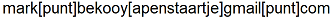

# Genealogieën van Bekooy

Deze website is een beter gestructureerde versie van [http://www.at16home.demon.nl/BEKOOY.htm](http://www.at16home.demon.nl/BEKOOY.htm).  
**De inhoud is hetzelfde gebleven**.  

Voor een versie waarbij de inhoud is gewijzigd om beter leesbaar te zijn, bekijk: [Het Leidse Geslacht (verbeterde tekst)](Het%20Leidse%20geslacht%20Bekooy%20verbeterd.md)

*Contact:*  

## Table of Contents
- [Genealogieën van Bekooy](#genealogieën-van-bekooy)
  - [Table of Contents](#table-of-contents)
  - [DE BUCQUOY/BEKOOY/BOEKKOOI EN DE BUCQUOY/DE KLOPPER IN LEIDEN](#de-bucquoybekooyboekkooi-en-de-bucquoyde-klopper-in-leiden)
  - [GENEALOGIEËN BUCQUOY/BEKOOY/BOEK(K)OO(I,Y), LEIDEN](#genealogieën-bucquoybekooyboekkooiy-leiden)
- [GENEALOGIEËN DE BUCQUOY/BEKOOY](#genealogieën-de-bucquoybekooy)
  - [A. OLIVIER (?) DE BUCQUOY EN ZIJN AFSTAMMELINGEN](#a-olivier--de-bucquoy-en-zijn-afstammelingen)
    - [I. Olivier (?) de Bucquoy](#i-olivier--de-bucquoy)
    - [IIa. Arnou de Bucquoys](#iia-arnou-de-bucquoys)
    - [IIb. Anthoine de Bucquoy](#iib-anthoine-de-bucquoy)
    - [IIIa. Elias de Buko](#iiia-elias-de-buko)
    - [IIIb. Olifier de Buquo](#iiib-olifier-de-buquo)
    - [IIIc. Pier de Bucquoy](#iiic-pier-de-bucquoy)
    - [IIId. Anthoine des Boucquois](#iiid-anthoine-des-boucquois)
    - [IIIe. Lowijs de Buckoy](#iiie-lowijs-de-buckoy)
    - [IIIf. Gilles de Bucquoy](#iiif-gilles-de-bucquoy)
    - [IIIg. Olifier de Buckoy](#iiig-olifier-de-buckoy)
    - [IVa. Pierre de Bucquoy](#iva-pierre-de-bucquoy)
    - [IVb. Jheremias de Bucquoy](#ivb-jheremias-de-bucquoy)
    - [IVc. Pierre de Bucquoy](#ivc-pierre-de-bucquoy)
    - [IVd. Olivier de Bucquoy](#ivd-olivier-de-bucquoy)
    - [Va. Pieter Bucquoy](#va-pieter-bucquoy)
    - [Vb. Johannes de Bucquoy](#vb-johannes-de-bucquoy)
    - [Vc. Jean de Bucquoy](#vc-jean-de-bucquoy)
    - [Vd. Gillis Pietersz de Bucquoy](#vd-gillis-pietersz-de-bucquoy)
    - [VIa. Abraham Bukoy](#via-abraham-bukoy)
    - [VIb. Isack Bucquoy](#vib-isack-bucquoy)
    - [VIIa. Jan Bekooy](#viia-jan-bekooy)
    - [VIIb. Abraham Buckooy](#viib-abraham-buckooy)
    - [VIIIa. Leendert Bekooy](#viiia-leendert-bekooy)
    - [VIIIb. Isaac Bekooy](#viiib-isaac-bekooy)
    - [VIIIc. Abraham Bekooy](#viiic-abraham-bekooy)
    - [IXa. Johannes Bekooy](#ixa-johannes-bekooy)
    - [IXb. Leonardus Gerard Bekooy](#ixb-leonardus-gerard-bekooy)
    - [IXc. Abraham Bekooy](#ixc-abraham-bekooy)
    - [IXd. Pieter Bekooy](#ixd-pieter-bekooy)
    - [IXe. Hendrik Bekooy](#ixe-hendrik-bekooy)
    - [Xa. Johannes Bekooy](#xa-johannes-bekooy)
    - [Xb. Johannes Antonie Bekooy](#xb-johannes-antonie-bekooy)
    - [Xc. Pieter Bekooy](#xc-pieter-bekooy)
    - [Xd. Abraham Bekooy](#xd-abraham-bekooy)
    - [XIa. Jacobus Bekooy](#xia-jacobus-bekooy)
    - [XIb. Bartholomeus Bekooy](#xib-bartholomeus-bekooy)
    - [XIc. Pieter Albertus Bekooy](#xic-pieter-albertus-bekooy)
    - [XIIa. Jacobus Bekooy](#xiia-jacobus-bekooy)
    - [XIIb. Johannes Bekooy](#xiib-johannes-bekooy)
  - [B. JEAN (?) DE BUCQUOY EN ZIJN AFSTAMMELINGEN](#b-jean--de-bucquoy-en-zijn-afstammelingen)
    - [I. Jean (?) de Bucquoy](#i-jean--de-bucquoy)
    - [IIa. Walram de Bucquoy](#iia-walram-de-bucquoy)
    - [IIb. Philippe ? de Bucquoy](#iib-philippe--de-bucquoy)
    - [IIIa. Jean de Bucquoy](#iiia-jean-de-bucquoy)
    - [IIIb. Gerard du Bucquoy](#iiib-gerard-du-bucquoy)
    - [IIIc. Anthony de Bucquoy](#iiic-anthony-de-bucquoy)
    - [IIId. Philips de Bucquoy](#iiid-philips-de-bucquoy)
    - [IIIe. Jan de Bucquoy](#iiie-jan-de-bucquoy)
    - [IVa. Walran (Warnaar) de Bucquoy](#iva-walran-warnaar-de-bucquoy)
    - [Va. Jacobus de Bucquoy](#va-jacobus-de-bucquoy)
    - [VIa. Warnaar Bekooy](#via-warnaar-bekooy)
    - [VIb. Jacob Bekooy](#vib-jacob-bekooy)
    - [VIIa. Jacobus Boekooy](#viia-jacobus-boekooy)
    - [VIIb. Anthony Bekooy](#viib-anthony-bekooy)
    - [VIIc. Jacobus Bekooy](#viic-jacobus-bekooy)
    - [VIIIa. Jacobus Bekooy](#viiia-jacobus-bekooy)
    - [VIIIb. Jan Boekooy](#viiib-jan-boekooy)
    - [VIIIc. Gerrit B(o)ekooy](#viiic-gerrit-boekooy)
    - [VIIId. Anthony Boekkoij](#viiid-anthony-boekkoij)
    - [VIIIe. Jacob Bekooy](#viiie-jacob-bekooy)
    - [VIIIf. Pieter Bekooy](#viiif-pieter-bekooy)
    - [VIIIg. Abraham Johannes Bekooy](#viiig-abraham-johannes-bekooy)
    - [VIIIh. Japik (Jacob) Bekooy](#viiih-japik-jacob-bekooy)
    - [VIIIi. Jacobus Bekooy](#viiii-jacobus-bekooy)
    - [VIIIj. Cornelis Bekooy](#viiij-cornelis-bekooy)
    - [IXa. Jacob Bekooij](#ixa-jacob-bekooij)
    - [IXb. Warnaar Bekooy](#ixb-warnaar-bekooy)
    - [IXc. Antonie Boekkooi](#ixc-antonie-boekkooi)
    - [IXd. Nicolaas Bekooy](#ixd-nicolaas-bekooy)
    - [IXe. Jacobus Bekooij](#ixe-jacobus-bekooij)
    - [IXf. Jacobus Bekooy](#ixf-jacobus-bekooy)
    - [IXg. Johannes Bekooi](#ixg-johannes-bekooi)
    - [IXh. Willem Bekooy](#ixh-willem-bekooy)
    - [Xa. Jacob Bekooy](#xa-jacob-bekooy)
    - [Xb. Jan Bekooy](#xb-jan-bekooy)
    - [Xc. Johannes Bekooy](#xc-johannes-bekooy)
    - [Xd. Johannes Jacobus Bekooy](#xd-johannes-jacobus-bekooy)
    - [Xe. Willem Bekooi](#xe-willem-bekooi)
    - [Xf. Jan Bekooi](#xf-jan-bekooi)
    - [XIa. Jacob Bekooy](#xia-jacob-bekooy)
    - [XIb. Abraham Bekooy](#xib-abraham-bekooy)
    - [XIc. Jan Bekooy](#xic-jan-bekooy)
    - [XId. Pieter Bekooy](#xid-pieter-bekooy)
    - [XIe. Hendrik Boekkooi](#xie-hendrik-boekkooi)
    - [XIf. Andries Bekooy](#xif-andries-bekooy)
    - [XIg. Jan Bekooy](#xig-jan-bekooy)
    - [XIh. Willem Bekooy](#xih-willem-bekooy)
  - [C. PHILIPPE DE BUCQUOY EN ZIJN AFSTAMMELINGEN](#c-philippe-de-bucquoy-en-zijn-afstammelingen)
    - [I. Philippe de Bucquoy](#i-philippe-de-bucquoy)
    - [II. Anthoni de Bucquoy](#ii-anthoni-de-bucquoy)
    - [IIIa. Philippus du Bucquoy](#iiia-philippus-du-bucquoy)
    - [IIIb. Abraham du Buquoy](#iiib-abraham-du-buquoy)
  - [D. ANTHONI DE BUCQUOY EN ZIJN NAKOMELINGEN](#d-anthoni-de-bucquoy-en-zijn-nakomelingen)
    - [I. Anthoni de Bucquoy](#i-anthoni-de-bucquoy)
    - [IIa. Jan de Bucquoy](#iia-jan-de-bucquoy)
    - [IIb. Anthony de Bucquoy](#iib-anthony-de-bucquoy)
  - [E. NIET PLAATSBAREN](#e-niet-plaatsbaren)
  - [F. DE BUCQUOY/DE KLOPPER](#f-de-bucquoyde-klopper)
    - [I. Louis de Bucquoy](#i-louis-de-bucquoy)
    - [II. Filis de Bucquoy](#ii-filis-de-bucquoy)
    - [III. Jacob Felixzn de Klopper](#iii-jacob-felixzn-de-klopper)
    - [IVa. Felix de Klopper](#iva-felix-de-klopper)
    - [IVb. Jacob de Klopper de Jonge](#ivb-jacob-de-klopper-de-jonge)
    - [V. Mr. Anthonie de Klopper](#v-mr-anthonie-de-klopper)
    - [VI. Mr. Felix de Klopper](#vi-mr-felix-de-klopper)
    - [VII. Dr. Paul Elzelin de Klopper](#vii-dr-paul-elzelin-de-klopper)
    - [VIIIa. Mr. Jan de Klopper](#viiia-mr-jan-de-klopper)
    - [VIIIb. Mr. Felix de Klopper](#viiib-mr-felix-de-klopper)
    - [IX. Adrianus Cornelis de Klopper](#ix-adrianus-cornelis-de-klopper)
  - [G. GEZINNEN IN AMSTERDAM](#g-gezinnen-in-amsterdam)
    - [A. NN Bucquoy](#a-nn-bucquoy)
    - [I. Jacques Bucquoy](#i-jacques-bucquoy)
    - [Jean. du Bukoy](#jean-du-bukoy)
    - [Ia. Jaques du Buskoy](#ia-jaques-du-buskoy)
    - [Ib. Jean de Bucquoy](#ib-jean-de-bucquoy)
    - [IIa. Jeronimus de Bucquoi](#iia-jeronimus-de-bucquoi)
    - [IIb. Pierre du Bucquoy](#iib-pierre-du-bucquoy)
    - [III. Jacob de Bucquoy](#iii-jacob-de-bucquoy)
  - [Referenties](#referenties)
    - [Notitie](#notitie)
  
## DE BUCQUOY/BEKOOY/BOEKKOOI EN DE BUCQUOY/DE KLOPPER IN LEIDEN

De geslachten A en B zijn eerder behandeld in Gens Nostra 63 (2008), pp 681 en volgende.  

De naam Bekooy en de later opduikende vorm Boekkooi zijn vernederlandste afleidingen van de Noordfranse naam (de) Bucquoy. Al kort na 1580 verschenen de eerste dragers van deze Franse naam in Leiden. Het eerste huwelijk van een naamdrager is daar geboekstaafd in 1585. Bij de volkstelling van 1580 komt de naam nog niet voor. De Leidse Bucquoys waren protestanten, en de eersten waren afkomstig uit plaatsen in de naaste omgeving van Tourcoing en Rijsel (Lille). Tussen Arras en Amiens, ongeveer 20 km ten zuidwesten van Arras, ligt een klein plaatsje Bucquoy aan de D 919 (op oudere kaarten: N 319). Hoewel men natuurlijk kan vermoeden dat hier de oorsprong van het Leidse geslacht ligt, heb ik daarvoor althans in Leiden geen aanwijzingen gevonden, en in Frankrijk heb ik geen onderzoek gedaan. Opgemerkt moet wel worden, dat (de omgeving van) Rijsel toch wel tamelijk ver van Bucquoy verwijderd is. Niettemin is er aanleiding iets nader in te gaan op een eventueel verband tussen de plaatsnaam en de geslachtsnaam.  

In de spelling Bu(c)quoy(e) komt de geslachtsnaam nog voor in België en in Noord Frankrijk. Een Belgische naamdrager, E. Buquoye, deed in eigen beheer in 1980 onder de titel ‘Album Buquoy, 1071 – 1980’ een lijvig boekwerk het licht zien, dat onder meer aanwezig is in het CBG. In zijn overigens door fouten en omissies ontsierde werk (zie Mededelingen van het Centraal Bureau voor Genealogie 36 (1982), nr. 4, p. 3) oppert de auteur, dat de Bekooys en hun bijna-naamgenoten in andere landen uit het oude adellijke Franse geslacht van de Graven de Bucquoy stammen. Hij baseert zich hierbij, behalve op de naam, op familie-overlevering in een Nederlandse familie, zonder daarop overigens nader in te gaan. Het plaatsje Bucquoy lag in de 16e eeuw in de invloedssfeer van de Spaanse koningen, en het was Philips II die op 20 juni 1580 het plaatsje met de naaste omgeving tot graafschap verhief. De eerste graaf werd Maximilien de Longueval. De Longuevals behoorden tot een oud geslacht van lage adel (Seigneurs of Heren). Na zijn verheffing tot graaf voegde Maximilien de plaatsnaam Bucquoy aan zijn geslachtsnaam toe, en hij en zijn nakomelingen gingen verder door het leven als Longueval-(De) Bu(c)quoy. De Longueval-Bucquoys waren vrome katholieken, en trouwe dienaren van de Spaanse en later de Oostenrijkse machthebbers in de Zuidelijke Nederlanden, waar zij veelal belangrijke ambten bekleedden. Uiteindelijk volgden zij hun leenheren naar Oostenrijk-Hongarije en kwamen in de Oostenrijkse adel terecht. Op dit moment is het voortbestaan van het geslacht voor nog tenminste een generatie verzekerd. De titelopvolger, zoon van de huidige graaf, is (was ?) discjockey in München. Wat de veronderstelde adellijke afstamming van de Nederlandse Bekooys betreft (met betrekking tot de Belgische en eventuele Franse Bu(c)quoys houd ik mij op de vlakte), deze meen ik naar het rijk der fabelen te moeten verwijzen. Ten eerste leefden in Leiden al Bucquoys op of zeer kort na het moment waarop de Longuevals de plaatsnaam aan hun geslachtsnaam toevoegden, en in Frankrijk zeker lang daarvoor. Alleen hierom al is een familierelatie met de Longueval-Bucquoys onwaarschijnlijk. Daarbij komt, dat de Longueval-Bucquoys gelovige, misschien wel fanatieke katholieken waren, terwijl de Leidse Bucquoys even gelovige protestanten waren.  

Opmerkelijk is, dat de immigratie van Bucquoys in Leiden in enkele golven kwam. De eerste golf vond plaats kort na 1580, en bestond (vrijwel) uitsluitend uit personen die uit Tourcoing kwamen. Er waren vrijgezelle mannen en vrouwen bij, van wie sommigen al snel in Leiden trouwden, maar ook gezinnen met kinderen die nog in Tourcoing waren geboren, en die rond 1600 of nog iets later in Leiden hun partner vonden. Het ligt voor de hand aan te nemen, dat tussen deze personen en gezinnen familiebanden bestonden, en die zijn in veel gevallen ook gevonden. Ook blijkt, dat de sommige leden van die golf een zekere welstand genoten. Er zijn verschillende documenten overgeleverd, waaruit blijkt dat bijv. voor die tijd aanzienlijke interesten op obligaties vanuit Frankrijk werden overgemaakt. Sommige nakomelingen van de eerste golf waren ook werkzaam als greinreder, wat, anders dan greinwerker, betekent dat zij zelfstandig ondernemer waren. Heel voorzichtig mag men dan besluiten, dat de eerste golf dus eerder religieuze dan economische immigranten telde. Een tweede golf kan ongeveer 1640 worden gedateerd. Deze betrof veel personen die afkomstig waren uit Bondues, Mouveaux (plaatsjes in de naaste omgeving van Tourcoing), en ‘Waterloo’ of ‘Waterleeuw’. Wat deze laatste plaats betreft, ben ik geneigd aan te nemen dat het hier het huidige Wattrelos betreft, dat eveneens dicht bij Tourcoing ligt, en niet het verderaf gelegen Waals-Brabantse Waterloo. De personen uit deze golf waren over het algemeen werkzaam als textielarbeiders, en duidelijk in minder goeden doen dan hun voorgangers. Bij hen speelde vermoedelijk een combinatie van godsdienstige en economische motieven een rol. Intussen kwamen in Leiden ook enkele Bucquoys aan uit andere plaatsen, zoals ‘Gernesy’ (Guernsey ?) en ‘Cantelbergen in Engelant’. Van hen kan ik niet met enig vertrouwen stellen, dat zij gerelateerd waren aan reeds in Leiden wonende naamgenoten. De genealogie-Bucquoy/Bekooy in Leiden valt dus, ook vanwege het ontbreken van eigen onderzoek in Frankrijk, uiteen in een aantal takken en takjes, waarvan sommige vermoedelijk wel aan elkaar verwant zijn, andere mogelijk niet. Ook de al genoemde heer E. Buquoye, die wel Frans onderzoek door een Franse naamdrager vermeldt, vindt overigens geen verbanden. Behalve naar Leiden, kwamen in het begin van de 17e eeuw ook Bucquoys naar andere plaatsen in de noordelijke Nederlanden. Zo zijn er rond 1620 meldingen in Amsterdam van huwelijken van Bucquoys die uit of via Middelburg kwamen. De eerste Bucquoys zullen ook in Middelburg al rond 1580 zijn verschenen. Ook verschijnen in Amsterdam Bucquoys uit Antwerpen en Keulen. Aan het eind van de genealogieën heb ik een sectie ‘Gezinnen in Amsterdam’ toegevoegd. Meer nog dan in Leiden vormen de Bucquoys in Amsterdam een verzameling ‘los zand’. Ik heb de genealogieën van de Amsterdamse families (inmiddels alle reeds lang uitgestorven) slechts oppervlakkig uitgezocht, met als enig doel een eventuele familierelatie met de Leidse naamgenoten te vinden. Uit niets blijkt zo’n band. Later vinden we ook naamdragers in Delft en Rotterdam, en hier is evenmin vast te stellen, of er familiebanden met de Leidse Bucquoys bestonden. Gezien de totale omvang van de instroom van Bucquoys in de Republiek kan gesteld worden, dat al voor 1600 de naam in Noord-Frankrijk ruim verbreid was.  

Een andere opmerking van bovengenoemde heer Buquoye snijdt meer hout. Hij oppert, dat het Leidse geslacht De Klopper verwant kan zijn aan de Bucquoys. Hij baseert dat op een verwantschap van de naam Bucquoy met een oud-Frans woord, dat onder meer kloppen betekent. In een serie Franstalige dictionaires die ‘on line’ zijn in te zien vinden we, dat het werkwoord ‘buquer’ inderdaad kloppen (‘frapper’) of stoten (‘heurter’) betekent. Het woord is in onbruik geraakt, maar wordt in de 19e eeuw nog in Franse teksten gevonden. De gelijkenis met het Nederlandse werkwoord ‘beuken’, waarvan een inmiddels ook verouderde betekenis eveneens kloppen is, dringt zich op. In Nederlandse etymologische woordenboeken wordt ‘beuken’, evenals soortgelijke woorden in andere talen, beschouwd als een onomatopee (klanknabootsend woord). In Nederland is een geslacht De Klopper tot het patriciaat gaan behoren. Een korte en in details onjuiste stamboom van dit geslacht, beginnend met een Jacob Philipsz de Klopper, is te vinden in Nederland’s Patriciaat 10 (1919). In dit artikel geef ik een uitgebreidere stamboom, met aanvullingen en correcties uit diverse bronnen en eigen onderzoek. Overigens leefden al in het begin van de 17e eeuw De Kloppers in Leiden, Vlaamse immigranten (en dus Nederlandstalig, in tegenstelling tot de eerste generaties van de Bucquoys), van wie sommigen via Engeland (Sandwich) in Leiden terechtkwamen. Deze De Kloppers zijn al na enige generaties verdwenen, en van enige relatie met het hieronder beschreven patricische geslacht is mij niets gebleken. Het patricische geslacht De Klopper is naar mijn mening uitgestorven.  

Naast de in de titel genoemde geslachten wordt ook oppervlakkig aandacht besteed aan de zeer waarschijnlijk niet, en zeker niet direct, verwante Bekooys in Amsterdam, en aan een aantal niet plaatsbare naamdragers.  

## GENEALOGIEËN BUCQUOY/BEKOOY/BOEK(K)OO(I,Y), LEIDEN

Met betrekking tot de hierna volgende genealogieën-Bucquoy/Bekooy/Boek(k)oo(i,y) moet worden opgemerkt, dat in Leiden Nederduits-Gereformeerde dopen bewaard zijn gebleven, resp. pas werden geregistreerd, vanaf 1621. Waalse dopen zijn, met kleine lacunes, bewaard sinds ongeveer 1600. Dit houdt in, dat van de kinderen van de tweede generatie, d.w.z. uit de vroegst vermelde huwelijken, geen doopgegevens beschikbaar zijn, en dat van vroeg overleden kinderen en van kinderen die ongehuwd bleven zeer weinig tot niets bekend is. Voor familierelaties in de eerste gezinnen moeten we dus terugvallen op huwelijken van de tweede generatie en doopgegevens van kinderen uit de derde generatie, zoals doopgetuigen etc. In veel gevallen, nl. waar dat onduidelijke familie-relaties kan verhelderen, zijn doop- en/of huwelijks-getuigen vermeld. Mijn maatstaf om personen op te nemen in de genealogie was, dat zij deel moesten uitmaken van een lijn van tenminste twee generaties (teruggaand of voortschrijdend). Zodoende is een aantal ‘loslopende’ figuren niet opgenomen, ook al was in sommige gevallen een (niet-lijn-)relatie met anderen die wel in de genealogie passen, aannemelijk. Niettemin heb ik de ondertrouwgegevens van deze personen wel opgenomen in een aparte sectie ‘Niet plaatsbaren’. De nummers bij die personen verwijzen naar de inschrijvingen in het Kerkelijk Ondertrouw register in Leiden. M.b.t. overlijdens is op te merken, dat vooral in de tweede helft van de 17e en in de 18e eeuw in Leiden slechts zelden overlijdensdata werden genoteerd. Meestal vindt men slechts de kalenderweek waarin de begrafenis plaatsvond. Daar waar wel een specifieke datum is vermeld, d.i. vooral in de eerste decennia van de 17e eeuw, neem ik aan dat dat de begrafenisdatum was. Tot ca. 1900 heb ik alle geboortes, huwelijken en overlijdens opgenomen. Het blijkt, dat van de geslachten A en B nog naamdragende leden leven, terwijl de geslachten C en D zijn uitgestorven. Ook de naamsvariant Boekkooi beklijft tot op heden. Deze variant wordt uitsluitend gevonden bij leden van het geslacht B.  

In de genealogie zijn de plaatsnamen gespeld zoals ik ze in de papieren tegenkwam. De (thans) correcte spelling volgt hier: Bondu = Bondues; Turkeng en andere varianten = Tourcoing; Rijsele, Rijssel, heet thans Lille; Movou etc. = Mouvaux; Waterloo/Waterleeuw = (naar mijn mening) Wattrelos, nabij Tourcoing (dus niet het Waals-Brabantse Waterloo!). Daar waar ik vermoedelijke (dus niet in de papieren gevonden) geboorteplaatsen vermeld, met name dus bij kinderen die in het verband van hun ouderlijk gezin naar Leiden kwamen, heb ik de juiste spelling gebruikt. Wat de spelling van de toenamen betreft, heb ik de vorm gebruikt die bij de ondertrouw of (na 1811) het burgerlijk huwelijk werd gevonden. Indien bij de doop of aangifte van kinderen de spelling van de toenaam van de vader van deze vorm afweek (wat nogal eens voorkwam), is de afwijkende vorm bij de naam van het kind vermeld.  

Gebruikte afkortingen:  
- ondertrouw/tr. = ondertrouw/trouw  

# GENEALOGIEËN DE BUCQUOY/BEKOOY

## A. OLIVIER (?) DE BUCQUOY EN ZIJN AFSTAMMELINGEN  

### I. Olivier (?) de Bucquoy
I.    Olivier (?) de Bucquoy, vermoedelijk geboren in Tourcoing ca. 1500, vermoedelijk overleden Tourcoing, tr. met NN.  

Hieruit vermoedelijk, eveneens geboren in Tourcoing, volgorde onbekend:  
1. Arnou, geboren ca. 1530, volgt [IIa](#iia-arnou-de-bucquoys)  
2. Anthoine, geboren ca. 1530, volgt [IIb](#iib-anthoine-de-bucquoy)  

De veronderstelling dat de ‘stamvader’ Olivier heette, is gebaseerd op het feit, dat zijn beide bekende zoons een zoon Olivier hadden.  

### IIa. Arnou de Bucquoys
IIa    Arnou de Bucquoys, geboren en waarschijnlijk overleden Tourcoing ca. 1530 - ca. 1585, tr. met NN.  

Uit dit huwelijk, vermoedelijk geboren in Tourcoing, volgorde onbekend, :  
1. Elie, geboren ca. 1560/65, volgt [IIIa](#iiia-elias-de-buko)  
2. Olivier, geboren ca. 1560/65, volgt [IIIb](#iiib-olifier-de-buquo)  
3. Pierre, geboren ca. 1560/65, volgt [IIIc](#iiic-pier-de-bucquoy)  
4. Jacomijne de Buco, van omtrent Rijsele, ondertrouw op 02-03-1585 (getuige Anthonnis de Buco haar oom) met Jan Deuterre, van Bergen in Henegouwen, getuige Gerard le Plant zijn schoonvader. Uit dit huwelijk zijn geen kinderen gevonden, waardoor niet m.b.v. doop- en/of huwelijksgetuigen een nadere familierelatie kan worden bepaald. Aangezien echter haar oom Anthoine in leven en Arnou zeer waarschijnlijk overleden of althans niet in Leiden aanwezig was, is deze relatie naar mijn mening safe. Hetzelfde geldt voor Pierre ([IIa](#iia-arnou-de-bucquoys)-3), bij wiens huwelijk ook oom Anthoine getuigde.  

### IIb. Anthoine de Bucquoy
IIb    Anthoine de Bucquoy, waarschijnlijk geboren in Tourcoing ca. 1530, vermoedelijk begraven Leiden 24-03-1603, tr. met NN.  

Uit dit huwelijk, vermoedelijk geboren in Tourcoing, volgorde onbekend:  
1. Anthoine, geboren ca. 1566 (6), volgt [IIId](#iiid-anthoine-des-boucquois)  
2. Louis, geboren ca. 1560/70, volgt [IIIe](#iiie-lowijs-de-buckoy)  
3. Gilles, geboren ca. 1560, volgt [IIIf](#iiif-gilles-de-bucquoy)  
4. Olivier, geboren ca. 1560/70, volgt [IIIg](#iiig-olifier-de-buckoy)  
5. Mary de Buco, van Turcoyn, ondertrouw op 11-09-1591 (getuige Cathelijne Spiring haar (schoon-)zuster) met Pier Tybergien, van Turcoyn, overleden na 02-09-1629 (optreden als doopgetuige). De naam Pierre Tybergien (ook andere spellingen) behoort in deze periode aan tenminste 3 verschillende personen.  
6. Catryne de Bucquot, van Turquoin, mogelijk overleden/begraven (‘huisvrouw van Jan de Can op de Koepoortsgraft’) 27-12-1624, ondertrouw op 12-09-1587 (getuige Barbe de Bucquot en Marie Casteel) met Jan de Camp, van Bondue bij Rijssel.  
7. Barbe? de Bucquoy, begraven Leiden 25-03-1608  

IIb-4 ([IIIg](#iiig-olifier-de-buckoy)) Olivier trouwt, vergezeld door zijn vader ‘Abraham’, met Cathelijne Spi(e)ring. De echtgenoot van Mary de Buco, Pierre Tybergien, was een aangetrouwde oom van de kinderen van zowel Louis als Gilles (1). Datzelfde geldt voor Jan de Can (Camp), de man van Catryne de Bucquot. Louis en Gilles waren zoons van Anthoine (2). Uit deze beide referenties, gevoegd bij het optreden van schoonzuster Cathelyne Spiring bij het huwelijk van Mary, wordt duidelijk dat ook Olivier een zoon was van Anthoine (zie ook onder [IIIa](#iiia-elias-de-buko)), en dat Mary en Catryne hun zusters waren. Daarbij komt nog, dat de ondertrouw van Olivier de enige literatuurplaats is waar ‘Abraham’ verschijnt. Er heeft naar alle waarschijnlijkheid althans in Leiden niet zo’n vroege ‘Abraham’ de Bucquoy geleefd. Later komt de naam wel voor.  

### IIIa. Elias de Buko
IIIa    Elias de Buko, van Turkeng in Vlaanderen, geboren ca. 1560, overleden Leiden aan de pest 07-09-1602, Nederduits Gereformeerd ondertrouw op 03-08-1585 (getuige Anton de Buko zijn oom) met Jacomyne du Pré, van Armentiers, getuige Claret du Pré haar moeder.  

Uit dit huwelijk bekend:  
1. Elie, Waals gedoopt Leiden 05-11-1600, leeft nog 30-09-1629 (3)  

Elyas de Bucquoy werd op 1 mei 1600 als poorter ontvangen.  

Op 11-05-1607 brengen de voogden Olivier du Bucquoy Anthonisz en Olivier de Bucquoy Arnoutsz een bedrag van 100 gld ter weeskamer, zijnde de opbrengst van een obligatie gedateerd 15-05-1603, op naam van ‘Elias du Bucquoy Arnouts zoons weeskint genaemt Elias’. Zij hebben het geld ontvangen van Jaspar du Pré, van Armentières. Op 15-10-1607 brengen Olivier Arnoutsz en Olivier Anthonisz nog eens resp. 140 en 340 gld, eveneens interest tot onderhoud van het kind (4). Na zijn quittering van Weesmeesters bij gelegenheid van zijn meerderjarigheid (3) wordt van Elias Jr. niets meer vernomen.  

### IIIb. Olifier de Buquo
IIIb    Olifier de Buquo, fils d’Arnou, van Turkoyn, (overleden/begraven 06-06-1616; voogdijstelling 17-08-1616), weduwnaar van Joseyne Liagre, wolkammer, ondertrouw op 08-11-1602 (getuige Jasper du Pré zijn bekende en Oliphier de Buquo zijn cosijn) met Martijne du Boys, van Verlenghem bij Rijssele, weduwe van Anthone Monier.  

Uit het eerste huwelijk bekend (5):  

1. Elisabeth de Bucquoy, geboren ca. 1590, 1) ondertrouw op 14-03-1614 met Bernaerdt Legete, baaiwerker, van Tweyne in Henegouwen, 2) ondertrouw op 29-01-1627 met Anthoni Haveyne (Avenne), wolkammer.  

Uit het tweede huwelijk bekend:  

2. Judith de Bucquoy, geboren in 1603 (5), ondertrouw op 23-03-1626 met Aman Barnyer, wolkammer van bij Valencijn.  

Drie kinderen van een Olivier de Bucquoy, die woonde op de Oosterlingplaats, werden begraven op 7 en 16 september 1609 (pest) en 8 januari 1606. Indien het deze Olivier betreft, moeten dat kinderen uit zijn eerste huwelijk zijn. Een alternatieve mogelijkheid is, dat het kinderen van zijn gelijknamige neef ([IIIg](#iiig-olifier-de-buckoy)) waren. Van deze zijn echter maar 4 kinderen gevonden, van wie er in elk geval twee overleefden.  

### IIIc. Pier de Bucquoy
IIIc    Pier de Bucquoy, weduwnaar van Van Turcoingen, Waals ondertrouw op 05-05-1600 (getuige Anthony de Bucquoy zijn oom en Samuel Mephuys (?) zijn schoonbroeder) met Judick Amory, van Amarsy, getuige Sjenne Amory haar zuster en Rebecca Hoene haar bekende.  

Uit een eerder huwelijk bekend:  

1. Mary de Bucquo, van Bondu, mogelijk overleden/begraven (‘huisvrouw van Davidt Lanoy, woont Nieuwe Stadt’) 23-11-1637, ondertrouw op 28-12-1613 (getuige Judith Amory haar (stief-)moeder) met Davidt de Lano, wolkammer van Leyden, getuige Charles de Lano zijn vader en Davidt de Hopa zijn zwager. Dat de bruid uit het eerdere huwelijk van haar vader moet stammen, is duidelijk.  

Uit het tweede huwelijk:  

2. Jacques, Waals gedoopt 09-06-1603  
3. Jean, Waals gedoopt mei 1605  
4. Pierre, Waals gedoopt 1e kw. 1607, volgt [IVa](#iva-pierre-de-bucquoy)  
5. Sara de Bucquoy, Waals gedoopt 08-03-1615, woont bij de Byercaey, ondertrouw op 04-01-1636 (getuige Maria de Bucquoy haar zuster) met Jan Thonis le Toeur, fusteinwerker, woont Corte Scheystraet, getuige Pieter le Toeur zijn broer.  

### IIId. Anthoine des Boucquois
IIId    Anthoine des Boucquois, van Tourcquoin, waarschijnlijk geboren in 1566 (6), kousenbreier (7), ondertrouw op 12-04-1586 (getuige zijn vader Anthoine de Bouckois en zijn broeder) met Marie Ruytere, van Tourquoin, getuige Barbara Camer haar nicht en Ysabeaux Plantefebre.  

Uit dit huwelijk zijn geen kinderen gevonden.  

### IIIe. Lowijs de Buckoy
IIIe    Lowijs de Buckoy, van Turcoyn, overleden voor 02-08-1604, ondertrouw op 31-12-1588 (getuige Antony de Buckoy zijn vader) met Martijne Bodijn, van Armentiers, getuige Marya Pronye haar moeder en Antonette Bodijn haar zuster.  

Uit dit huwelijk bekend:  
1. Jeremy, geboren ca. 1588, volgt [IVb](#ivb-jheremias-de-bucquoy)  
2. Jan, geboren ca. 1594.  

Op 02-08-1604 heeft Olivier du Bucquoy, kousenbreier, ter kamer gebracht de som van 183 gld. 5 st. over wat hij schuldig was ten bate van Pierre, ca. 23 jaar en Susanna, 16 jaar, nagelaten kinderen van Gillis du Bucquoy, en van Jeremias, 16 jaar, en Jan, 10 jaar, nagelaten kinderen van Louys de Bucquoy (7)  

Jan de Bucquoy (IIIe-2) was mogelijk gehuwd. Een huwelijk is niet gevonden, evenmin als dopen van kinderen. Op 8 september en 1 en 15 oktober 1624 en op 28 oktober 1627 en 4 januari 1629 werden kinderen begraven van een Jan Bu(c,k)oy die in of bij de Olifantspoort woonde.  

### IIIf. Gilles de Bucquoy
IIIf    Gilles de Bucquoy, geboren in Tourcoing (?), overleden voor 20-01-1595, tr. met Philippote Montaigny (de Montagne), overleden 29-02-1640, (Zij hertrouwde op 20-01-1595 met Philippe de Tombe).  

Uit dit huwelijk bekend:  
1. Pierre, geboren in Antwerpen ca. 1582, volgt [IVc](#ivc-pierre-de-bucquoy)  
2. Susannetgen de Bucquoy, geboren in Leiden (?) ca. 1588, mogelijk overleden/begraven (‘huisvrouw van Jan Karren op de Uytterste Graft’) 18-11-1622, Waals ondertrouw op 22-04-1611 (getuige Philippote Montegny haar moeder en Cathelyne Spierings haar moeye) met Jan Carret, kleermaker, van Marche bij Rijssel, getuige Pierre Bonduwel en Jheremias de Bucquoy. Jan Carret is mogelijk overleden/begraven als Jan Karre op de Uytterste Graft op 15-10-1624.  

### IIIg. Olifier de Buckoy
IIIg    Olifier de Buckoy, van Turcoyn, overleden/begraven 17-01-1620, ondertrouw op 26-08-1589 (getuige Abraham de Buckoy (moet naar mijn mening Anthoine zijn), zijn vader (8)) met Cathelijne Spiering, van Doornick, getuige Margriet van Aelst en Marye Flaman, zuster van Cathelyna.  

Uit dit huwelijk bekend, volgorde niet geheel bekend:  
1. Annetgen des Bucquoy, geboren in Leiden ca. 1598, Waals ondertrouw op 19-07-1618 (getuige Catrijne Spierings haar moeder) met ds. Petrus Moyses, van Leyden, woont Nieuweveen.  
2. Olivier, geboren ca. 1600, volgt [IVd](#ivd-olivier-de-bucquoy)  
3. Marie, Waals gedoopt 04-02-1601  
4. Chaterine, Waals gedoopt 24-02-1602  
  
### IVa. Pierre de Bucquoy
IVa    Pierre du Bucquoy, Waals gedoopt 1e kwartaal 1607, woont St. Aechtenstraet, droogscheerder, ondertrouw op 16-05-1639 (getuige Jan la Tour zijn zwager) met Jenne Nolaa, weduwe van Jaecques de Pla, woont St. Aechtenstraet, getuige Mary Fremault, haar moeder. (Jaques de Pla, bouratier van Bondu, ondertrouw op 11-08-1626 met Jeanne Nolet, van Turcogne. Geen getuigen genoemd. Jeanne Nolet/Jenne Nolaa was waarschijnlijk dochter van Gautier Nolet en NN. Mary Fremault was diens tweede echtgenote).  

Uit dit huwelijk:  
1. Pierre, Waals gedoopt 26-02-1640, getuige Jan de le Seur, Esarie Cornar, Marie Desbucquoy et Marie Frentau, volgt [Va](#va-pieter-bucquoy)  
2. Judith, Nederduits Gereformeerd gedoopt 17-04-1641, getuige Jan de la Tour, Maria Buquoy, Sara de Buquoy.  
3. Janneken, Nederduits Gereformeerd gedoopt 17-04-1641, getuige Jan de la Tour, Maria Buquoy, Sara de Buquoy.  
4. Judith, Waals gedoopt 06-09-1643, getuige Nicolas Loquefier, Marie Loquefier et Judith de Lanoy.  
5. Jean, Waals gedoopt 05-03-1645, getuige Nicolas et Judith Loquisier, volgt [Vb](#vb-johannes-de-bucquoy)  

### IVb. Jheremias de Bucquoy
IVb    Jheremias de Bucquoy, geboren in Leiden ca. 1588, passementwerker, overleden niet lang voor 03-04-1636 (9), 1) Waals ondertrouw op 21-01-1611 (getuige Pieter Bodeyn zijn beste vader (= grootvader) en Olivier de Bucquoy zijn oom) met Proontgen van den Camere, van Turcoingen, overleden voor 03-04-1636, 2) tr. (?) met Adriaentgen Cornelisdr (9).  

Uit het eerste huwelijk:  

1. Lowijs, geboren op 11-09-1611, Waals gedoopt 29-01-1612, overleden voor 03-04-1636 (9)  
2. TODO: Martine de Bucquoy, Waals gedoopt ??-3/4/5-1614, tr. voor 1647 (?) met Andries Aertsz van der Schuyren, mogelijk te Utrecht (10).  
3. Jeremias, geboren in 1616/17, overleden voor 1647 (?)  
4. Jan, Nederduits Gereformeerd gedoopt 30-12-1621, volgt [Vc](#vc-jean-de-bucquoy)  

Uit het tweede huwelijk (huwelijk en doop niet gevonden):  

5. Cornelis, geboren in 1635 (9)  

### IVc. Pierre de Bucquoy
IVc    Pieter de Bucquoy. geboren in Antwerpen ca. 1582, wolkammer, woont Medenblick, ondertrouw in Leiden op 22-11-1607 met Willem(tge) Dircxdr, van Medenblick.  

Uit dit huwelijk bekend (volgorde onbekend):  
1. Dirk, geboren in Medemblik voor 1610, woont 1634 in Medemblik (11).  
Aangezien Dirk in 1634 wordt genoemd in het testament van zijn broer Gillis als mogelijk beheerder van diens erfenis, zal Dirk meerderjarig geweest zijn (d.i. 25 jaar of ouder).  
2. Gillis, geboren in Medemblik ca. 1610, volgt [Vd](#vd-gillis-pietersz-de-bucquoy)  
3. Theunis, geboren in Medemblik  
Theunis de Bucquoy, greinwerker van Medemblik, is op 11-08-1645 op de getuigenis van Jacob Willemsz de Laet en Gillis de Bucquoy als poorter ontvangen. Verder vernemen we niets van hem.  

### IVd. Olivier de Bucquoy
IVd    Olivier Bucquoy, herkomst niet genoemd, woont Bredestraet, begraven 09/15-01-1667[†](#notitie), ondertrouw op 27-09-1629 (getuige Olivier Bucquoy, zijn vader en Sophia van Dilsen, haar moeder. Sophia van Dilsen ondertrouw op 29-10-1598 met Paulus Stock) met Claesgen Stockius, woont Bredestraet, geboren ca. 1605, overleden 28-10-1669.  

Uit dit huwelijk:  
1. Pieternella, Nederduits Gereformeerd gedoopt 05-03-1631, begraven 16-04-1631  
2. Pieternella de Bucquoy, Nederduits Gereformeerd gedoopt 25-08-1632, woont Bredestraet, begraven 02/08-09-1668[†](#notitie), ondertrouw op 10-08-1656 met Niclaes van Campen, woont Marckt, koopman.  
(Nicolaes van Campen, weduwnaar van Petronella Bucquoy, woont Bredestraet, ondertrouw op 19-03-1670 met Susanna de Hoorn, weduwe van Dirck van Assendelft, woont Nieuwen Rijn. De broer van de man is veertig in de raad.)  
3. Anna de Bucquoy, Nederduits Gereformeerd gedoopt 06-09-1634, overleden 13-02-1677, ondertrouw in Leiden op 04-10-1674, tr. in Leiderdorp op 23-10-1674 met Nicolaes Huyst, doop en overleden niet gevonden, wedn. Antonette Ravens, vermoedelijk zoon van Gillis Gillisz Huyst en Maeycken de Clercq.  
4. Alyda de Bucquoy, Nederduits Gereformeerd gedoopt 20-03-1637, woont Bredestraet, overleden/begraven 27-01-1680, ondertrouw op 15-01-1659, tr. op 04-02-1659 met Symon Vliettoorn, woont Bredestraet, apothecaris (geboren in Katwijk ?) (Simon Vliethoorn, schepen van Leyden, weduwnaar van Alida du Buquoy (!), woont Steenschuyr, Waals ondertrouw op 09-05-1680 met Margrieta de Quien, woont Oude Chingel. Een broer van Simon was kapitein van de burgerij.)  
5. Elisabeth du Bucquoy, Nederduits Gereformeerd gedoopt 09-09-1639, overleden voor 07-01-1676, ondertrouw op 08-06-1667 (getuige Clasyne Stockius haar moeder) met Frans Vromans, gedoopt 12-12-1641, overleden niet gevonden, zoon van Mr. Jacob Vromans en Jannetje du Merchijn. (Frans Vromans, wdnr Elisabeth de B, woont Bredestraet, ondertrouw op 07-01-1676 met Maria Leffen, woont Klocksteech.)  
6. Sophia, Nederduits Gereformeerd gedoopt 23-01-1643, begraven 15-05-1645  
7. Paulus, Nederduits Gereformeerd gedoopt 29-03-1645, begraven 25-04-1643  
8. Paulina de Bucquoy, Nederduits Gereformeerd gedoopt 25-04-1646, overleden na 07-11-1679, maar voor 08-11-1686 (hertrouwd 2e man), woont Steenschuur, 1) ondertrouw op 02-03-1673 met Benjamyn Muller, weduwnaar van Judith de l’Hommel, woont Hamburch, 2) tr. (?) met Andries van Roest, bode met de roede van Leiden.
Bij Benjamyn Muller had Paulina een voorzoon Benjamin Muller, wiens doop niet is gevonden, en die na het bereiken van de meerderjarigheid naar Suriname vertrok. Uit het (niet gevonden) tweede huwelijk (?) waren klaarblijkelijk geen kinderen. Behalve dit huwelijk zijn ook de overlijdens van de hoofdpersonen Benjamin Muller Sr, Paulina de Bucquoy en Andries van Roest niet gevonden (12).  

### Va. Pieter Bucquoy
Va    Pieter Bucquoy, Waals gedoopt 26-02-1640, greinwerker, woont St. Aechtenstraet, overleden voor 02-02-1669 (voogdijstelling), Waals ondertrouw op 02-04-1661 (getuige Sara Bucquoy zijn moeye) met Franchyntgen Jans, van Haerlem, overleden niet gevonden, (Franchyntge Jans, weduwe van Pieter du B, woont Cleystraet. ondertrouw op 02-02-1669 met Jan Roelofsz, woont Langegraft, lakenwerker)  

Uit dit huwelijk:  
1. Jeane, Waals gedoopt 05-08-1663, getuige Pierre du Bucquoy, Jean del Tour, Jeane Noulet et Judith de Lannoy.  
2. Pierre, Waals gedoopt 06-12-1665, getuige Jean de Bucquoy, Jaque Favarcque, Anne Fransse et Judith Castel.  

### Vb. Johannes de Bucquoy
Vb    Johannes de Bucquoy, Waals gedoopt 05-03-1645, woont Cruysstraet, greinwerker, ondertrouw op 01-09-1674 (getuige Claes Locquefier zijn neef) met Catharina le Franck, Waals gedoopt 09-03-1653, woont Cruysstraet, begraven 18/25-09-1717[†](#notitie), dochter van Charles de Francque en Catharine de Langle (l’Engle).  

Uit dit huwelijk:  
1. Sara Bucquoy, geboren op 30-08-1675, Waals gedoopt 01-09-1675, woont Meutiesteegh, ondertrouw (Schepenen) op 19-05-1703 (getuige haar moeder Catharina le Fran) met Cornelis Reyniersz, lakenwerker van Leiden, woont Nieuwe Levendael. N.B. De bruidegeom was RK.  
2. Rebecca, geboren op 14-06-1676, Waals gedoopt 20-06-1676  
3. Abraham, geboren op 11-10-1680, Waals gedoopt 13-10-1680, volgt [VIa](#via-abraham-bukoy)  
4. Isac, geboren op 04-03-1683, Waals gedoopt 07-03-1683, volgt [VIb](#vib-isack-bucquoy)  
5. Jacob, Nederduits Gereformeerd gedoopt 12-12-1685  

Bij de getuigen bij de dopen van de kinderen is geen enkele Bucquoy, allen zijn uit de schoonfamilie (of verder verwijderde familieleden).  

### Vc. Jean de Bucquoy
Vc    Jean de Bucquoy, Nederduits Gereformeerd gedoopt 30-12-1621, woont Paradijssteech, slotenmaker, ondertrouw op 28-08-1648 (getuige Abraham de Bodeyn zijn neef) met Susannetgen Jacobsdr, woont Paradijssteech.  

Uit dit huwelijk:  
1. Geertruijdt, Nederduits Gereformeerd gedoopt 15-05-1649, getuige Abraham Bodijn, Geertruijdt Bodijn, Neeltien Vreelings, Pieter Jacobsz.  

Jean de Bucquoy was een goed mathematicus en zou lector in de mathesis geworden zijn aan de Leidse universiteit (13).  

### Vd. Gillis Pietersz de Bucquoy
Vd    Gillis Pietersz de Bucquoy, van Medenblick, woont Vrouwencamp, bij 2e huwelijk Kijffhoek, wolkammer, mogelijk begraven 13/19-04-1664[†](#notitie) (‘(G?)Illis Bekoy, woont b/d Lakenhal’), 1) ondertrouw op 27-07-1640 (getuige Jan Caret zijn oom) met Sara Crauwelaers, van Leyden (getuige Judith Crauwelaers haar zuster), woont Groenhasegraft, (overleden Medemblik 25-09-1655, vermoedelijk aan de pest, mogelijk uit L. meegenomen), 2) ondertrouw op 15-06-1656 (getuige Ezechiel de Tombe zijn oom) met Verronne Wartelle, van bij Rijssel, weduwe van Pierre Sij, woont Oude Singel.  

Uit dit huwelijk:  
1. Willemtgen, gedoopt 24-07-1641, getuige Pieter Debucquoy, Jacob Krouwelaer, Willemtgen Dirckx en Judith Carette. Willemtgen overleed vermoedelijk (‘dochter van Gillis Bekoy, woont Kijfhoek’) op 20-09-1655 in Medemblik, vermoedelijk aan de pest, mogelijk uit L. meegenomen.  
2. Pieter, gedoopt 20-01-1644, getuige Pieter Dubuquoy, Jan Corette, Willemtgen Dirckx, Gillisgen van Molensteyn.  
3. Pieter, gedoopt 08-10-1645, getuige Pieter de Buquoy, Teunis de Buquoy, Susanna de Buquoy, Judith Crouwelaers  
4. Tanneken Bucquoy, gedoopt 12-03-1649, begraven Amsterdam 03-05-1685 (als vr. van Petter Eerassemus, welk huwelijk echter niet is gevonden), woont Oude Cingel, ondertrouw op 10-03-1668 met Abraham Costerus, woont Amsterdam, begraven aldaar 29-08-1679. Tanneken Gillis Bucquoy ontvangt 25-03-1668 attestatie naar niet vermelde plaats, kennelijk Amsterdam.  
5. Willem, gedoopt 13-03-1652.  

Gillis de Bucquoy wordt op 24-06-1641 als poorter ontvangen op de getuigenis van Olivier de Bucquoy de Jonge en Jacob Willemsz de Laet. Op 28-03-1634 verschijnt Gillis du Bucquoy, mr. wolkammer op de Oude Cingel, ziekelijk van lichaam, voor de notaris en machtigt zijn broer Dirk Pietersz de Bucquoy, woonachtig in Medemblik, en de Leidse koopman Joost Safelé om zijn eventuele erfenis te beheren voor zijn erfgenamen (11). Merk op dat hij toen nog niet getrouwd was.  

### VIa. Abraham Bukoy
VIa    Abraham Bukoy, geboren op 11-10-1680, Waals gedoopt 13-10-1680, tr.? (huwelijk niet gevonden) Magdalena Hoogenboom of Hoogenvleck,  

Uit dit huwelijk:  
1. Jan, gedoopt 11-03-1705, volgt [VIIa](#viia-jan-bekooy)  
2. Magdalena, gedoopt 29-09-1706 (getuige Catharina Franc)  

### VIb. Isack Bucquoy
VIb    Isack Bucquoy, geboren op 04-03-1683, Waals gedoopt 07-03-1683, molenaarsknecht, begraven 21/28-04-1736[†](#notitie), ondertrouw op 07-02-1711 met Anna de Vos, gedoopt 05-10-1687, begraven 10/17-02-1725[†](#notitie), dochter van Guilliaem de Vos en Maria Slosser.  

Uit dit huwelijk:  
1. Abraham, gedoopt 29-09-1711, volgt [VIIb](#viib-abraham-buckooy)  
2. TODO: Maria Bekooy, gedoopt 18-09-1712, begraven 17/21-11-1792[†](#notitie), 1) ondertrouw op 22-09-1735 met Jacob Verkouw, timmermansknecht van Remp(t)(?)in Gelderland, begraven 11/18-04-1744[†](#notitie), 2) ondertrouw op 09-03-1759 met Isaac Pel, laatst weduwnaar van Trijntje Bedier, gedoopt 14-08-1716, begraven Katwijk a/Z 10-02-1803, zoon van Isaack Pel en Katharina Risseveldt.  
3. Anna, gedoopt 15-02-1714,  
4. Catharina Bucquoy, gedoopt 17-05-1715, ondertrouw op 16-05-1732 met Adrianus Henneboo, grutter, van Leiden, vermoedelijk gedoopt 09-04-1698 als zoon van Adriaan Henneboo en Anna de Winter. Het paar krijgt 29-01-1741 attestatie naar Woerden.  
5. Angeniet Bekooy, gedoopt 14-01-1717, begraven 09/16-06-1781[†](#notitie), ondertrouw op 18-04-1739 met Claude le Soin, broodbakkersknecht, gedoopt 29-04-1714, begraven Leiderdorp 01-07-1802 als Glaude Leswijn, zoon van Paulus Leswijn en Maartje Cegon.  
6. Hendrina Bucquoy, gedoopt 16-03-1718, begraven 04/11-07-1772[†](#notitie), ondertrouw op 22-04-1740 met David de Risjouw, droogscheerder van Leiden, gedoopt 13-04-1718, begraven 24-06/01-07-1769[†](#notitie), zoon van David de Rouloi (= de Rousseau) en Abigael Neuteboom (ondertrouw met David de Rousseau en Abigael Noteboom op 17-07-1717, RAL KOT GG 204).  
1. Johanna Buckooy, gedoopt 22-10-1719, begraven 19/26-01-1799[†](#notitie), ondertrouw op 06-04-1742 met Hendrik van der Reyden, metselaarsknecht, gedoopt 01-05-1716, overleden voor 1799, zoon van Dirk van der Rijden en Johanna Copijn.  
2. Christina, gedoopt 16-03-1721  

### VIIa. Jan Bekooy
VIIa    Jan Bekooy, gedoopt 11-03-1705, kuypersknecht, ondertrouw op 05-08-1735 (getuige Isaac Bekooy zijn oom) met Joosje van Leeuwen, doop niet gevonden, begraven 08/15-01-1774[†](#notitie), dochter van Leendert Cornsz. van Leeuwen en Judick Isacks Wijngert.  
Het huwelijk van Leendert van Leeuwen en Judick Wijngert is niet gevonden. Wel is van hen een Akte van Seclusie bekend, gedateerd 06-06-1706. Na haar dood (begraven 19/26-02-1735[†](#notitie)) hertrouwde Leendert van Leeuwen met Maria Ruygewey (ondertrouw op 18-05-1736). Maria Ruygewey getuigde als Maria Ruygnoy bij de doop van het eerste kind Leendert van haar stiefdochter Joosje van Leeuwen en Jan Bekooy.  

Uit dit huwelijk:  
1. Leendert, gedoopt 14-10-1737, volgt [VIIIa](#viiia-leendert-bekooy)  
2. Katharina Buquooy, gedoopt 31-08-1738, overleden 26-01-1821, ondertrouw op 29-04-1768 met Johannes Taayspel, gedoopt 21-11-1745, rokjeswerker, overleden 27-12-1829, zoon van Daniël Taayspel en Margareta van Riet,  
3. Abraham, gedoopt 22-04-1742, begraven 18/25-04-1744[†](#notitie)  
4. Jan, gedoopt 21-04-1745, begraven 16/23-02-1754[†](#notitie)  

### VIIb. Abraham Buckooy
VIIb    Abraham Buckooy, gedoopt 29-09-1711, metselaarsknecht, woont Zijtgragt, overleden Banda 11-06-1759, ondertrouw op 23-04-1734 met Catharina Hartogh, gedoopt 08-06-1710, begraven 07/14-03-1778[†](#notitie), dochter van Johannes Hertige en Lysbeth Tijke.  

Uit dit huwelijk:  
1. Anna Buckooy, gedoopt 17-02-1735, begraven 07/14-07-1804[†](#notitie), 1) ondertrouw op 28-04-1752 met Johannes Mugge, gedoopt 08-11-1730, straatmakersknecht, vermoedelijk begraven 03/10-07-1784[†](#notitie), zoon van Hermannus Mugge en Jannetje van Hoecken, 2) ondertrouw op 20-03-1778 met Bart Gonsaal, gedoopt 12-03-1724, begraven 16/23-07-1791[†](#notitie), weduwnaar van Suzanne van Barte, zoon van Bartholomeus Gansal en Grietje de Broeder.  
2. Elisabeth Buqooy, gedoopt 17-03-1737, overleden 09-01-1815, ondertrouw op 18-03-1768 met Hendrik Mulhovius, gedoopt 19-09-1734, greinwerker, begraven 05/12-10-1799[†](#notitie), zoon van Pieter Mulhovius en Maria Veering.  
3. Isaac, gedoopt 13-09-1739 volgt [VIIIb](#viiib-isaac-bekooy)  
4. Catharina Bucquoy, gedoopt 03-06-1742, overleden 19-04-1813, begraven 23-04-1813, 1) ondertrouw op 16-12-1763 met Claas Boom, gedoopt 14-12-1729, wolkammersknecht, begraven 18/25-08-1770[†](#notitie), zoon van Abraham Boom en Magdalena Tijken, 2) ondertrouw op 15-05-1772 met Abraham van Putten, gedoopt 02-02-1744, warmoeziersknecht, begraven 03/10-08-1805[†](#notitie), zoon van Johannes van der Putten en Jannetje van den Dop, 3) ondertrouw op 28-08-1807, tr. op 12-09-1807 met Jan van Leeuwen, leeft nog 19-04-1813, weduwnaar van Styntje van Engelen.  
5. Geertruy Bekooy, gedoopt 30-12-1744, begraven 10/17-10-1778[†](#notitie), ondertrouw op 04-06-1773 met Willem Kloek, gedoopt 04-11-1751, mandemakersknecht, overleden na 1811 (niet gevonden), zoon van Pieter Kloek en Marytje Malie (= Mahieu).  
6. Johannes, gedoopt 14-06-1747  
7. Abram, gedoopt 30-11-1749, volgt [VIIIc](#viiic-abraham-bekooy)  

Abraham Bekooy is in 1756 met het schip ‘Slooten’ naar Indië gegaan en op 11 juni 1759 op Banda overleden (14).  

### VIIIa. Leendert Bekooy
VIIIa    Leendert Bekooy, gedoopt 14-10-1737, molenaarsknecht, overleden 14-04-1822, ondertrouw op 07-05-1762 met Francyntje van Leeuwen, overleden 12-02-1811, begraven 14-02-1811, waarschijnlijk gedoopt 15-05-1735 als dochter van Aart Jansz van Leeuwen en Trijntje Willems.  

Uit dit huwelijk:  
1. Jezyntje, gedoopt 22-03-1763, begraven 19/26-12-1767[†](#notitie)  
2. Maria Catharina Bekooy, gedoopt 27-06-1766, ongehuwd overleden 02-10-1829  
3. Alida Bekooy, gedoopt 10-01-1770, overleden Leiderdorp 24-05-1830, 1) ondertrouw op 14-04-1791 met Pieter van Klaveren, gedoopt 05-10-1768, melkverkoper, overleden Leiderdorp 11-08-1816, zoon van Willem van Klavere en Marytie van der Plas, 2) tr. in Leiderdorp op 22-03-1818 met Ary Poot, gedoopt Maasland 19-11-1786, jagersbaas, overleden Leiderdorp 13-09-1831, zoon van Jan Poot en Neltje van der Waal.  
4. Joannes, gedoopt 20-12-1772, volgt [IXa](#ixa-johannes-bekooy)  

### VIIIb. Isaac Bekooy
VIIIb    Isaac Bekooy, gedoopt Leiden 13-09-1739, metselaarsknecht, overleden na 01-1808, zoon van Abram Bekooy en Catharina Hartog, ondertrouw op 24-08-1764 met Geertruy Maas, gedoopt 03-08-1738, overleden 13-01-1808, begraven 16-01-1808, dochter van Aernout Maes en Immetje van Dorp.  

Uit dit huwelijk:  
1. Ongedoopt kind, geboren op 23-03-1765, begraven 30-03-1765  
2. Catharina Bucquoy, gedoopt 19-03-1766, begraven 16/23-10-1773[†](#notitie)  
3. Immetje Bekooy, geboren in 1768, dubbelaarster, overleden 03-04-1851, ondertrouw op 28-09-1792 (getuige haar moeder Geertruy Maas) met Frans van der Kaay, gedoopt 22-12-1771, baaijwerker, overleden 18-03-1810, zoon van Lucas van der Kaay en Dirkje Romeyn.  
Er is geen doop van een Immetje Bekooy gevonden. Immetje Bekooy, weduwe van Frans van der Kaay, overleed op 03-04-1851 (in de 10-jarentafel: Susannetje; de akte leest duidelijk Immetje) op 83-jarige leeftijd als dochter van Isaac Bekooy en Jannetje Romijn (??). Immetje Bekooy en Frans van der Kaay worden ook genoemd bij het huwelijk van hun dochter Hendrina in Rotterdam. Op 28-09-1792 werd (RAL, KOT YY 115) de ondertrouw geregistreerd tussen Jannetje (!) Bekooy en Frans van der Kaay.  
1. Abram, gedoopt 21-06-1769, begraven 09/16-10-1773[†](#notitie)  
2. Johanna Bekooy, gedoopt 22-09-1771, begraven 14/21-12-1771[†](#notitie)  
3. Arnoldus, gedoopt 22-11-1772  

### VIIIc. Abraham Bekooy
VIIIc    Abraham Bekooy, gedoopt 30-11-1749, metselaarsknecht, overleden 04-02-1815, ondertrouw op 22-04-1774 met Anna Mulhovius, gedoopt 18-12-1748, overleden 06-03-1818, dochter van Pieter Mulhovius en Maria Schrijver (Veering ??).  

Uit dit huwelijk:  
1. Catharina Bekooy, gedoopt 12-03-1775, overleden 06-01-1841, ondertrouw op 12-08-1796 met Jacobus van Dissel, lakenwerker, mogelijk gedoopt 02-10-1774 (als zoon van Isaac van Dissel en Hilletje van der Heiden), overleden 10-09-1814  
2. Pieter, gedoopt 27-11-1776, begraven 27-12-1777/03-01-1778[†](#notitie)  
3. Levenloos kind, geboren/overleden 01-05-1779, begraven 08-05-1779  
4. Johanna Bekooy, gedoopt 27-09-1780, overleden, ondertrouw op 02-06-1809, tr. op 17-06-1809 met Abraham Holswilder, gedoopt 28-08-1782, warmoezier, overleden 31-10-1813, zoon van Abram Holswilder en Maria Daelmeyer.  
5. Leonardus Gerard, gedoopt 23-07-1782, volgt [IXb](#ixb-leonardus-gerard-bekooy)  
6. Abraham, gedoopt 23-07-1782,  
7. Maria, gedoopt 01-09-1784, begraven 23/30-10-1784[†](#notitie)  
8. Abram, gedoopt 25-07-1787, volgt [IXc](#ixc-abraham-bekooy)  
9. Pieter, gedoopt 27-09-1789, volgt [IXd](#ixd-pieter-bekooy)  
10. Hendrik, gedoopt 08-07-1792, volgt [IXe](#ixe-hendrik-bekooy)  

### IXa. Johannes Bekooy
IXa    Johannes Bekooy, gedoopt 20-12-1772, letterzettersknecht, overleden 15-01-1843, 1) ondertrouw op 01-05-1795 met Jannetje Genon, gedoopt 20-09-1764, overleden Leiden 07-03-1825, buitenechtelijke dochter van Jan Genon en Grietje de Vink, 2) tr. in Zoeterwoude op 08-03-1830 met Anna Elisabeth Schröders, geboren en/of RK gedoopt Roermond 16-05-1770, overleden 14-11-1853, weduwe van D. Saris, dochter van Matthias Schroëders en Maria Josepha Sagers.  

Uit het eerste huwelijk:

1. Johannes, gedoopt 29-05-1796, volgt [Xa](#xa-johannes-bekooy)  
2. Helena Margareta Bekooy, gedoopt 01-04-1801, ongehuwd overleden 20-08-1885  
  ‘Onecht’ kind van Lena Bekooy, dienstbode, aangegeven door grootvader  
    - Johannes, 67 jaar: Johannes, geboren in nov./dec. 1839, overleden 09-05-1840  

Uit een relatie met Susanna Kloots (gedoopt 18-09-1767, overleden 31-08-1828, weduwe van Cornelis Groeneveld, dr. van Antonie Kloots en Neeltje Luzing):  

1. Johannes Antonie, ‘onecht’, gedoopt 07-10-1804, volgt [Xb](#xb-johannes-antonie-bekooy)  

N.B. De inschaling van Johannes Antonie Bekooy als zoon van deze Johannes Bekooy uit een relatie met Susanna Kloo(t)s is uitsluitend gebaseerd op het optreden van een Johannes Bekooy van de juiste leeftijd als getuige bij de geboortes van Johannes Antonie’s kinderen Bartholomeus en Maria Catharina. Noch de vernoemingen van zijn kinderen, noch de andere bij de geboortes optredende getuigen geven verdere indicaties. Susanna Kloots trouwde eerder (meer waarschijnlijk: had eerder een relatie met) Cornelis Groeneveld, gedoopt 13-12-1770, overleden Leiden, begraven Oegstgeest 16-07-1802, zoon van Bartholomeus Groeneveld en Jannetje Sterk. Het overlijden van Susanna werd aangegeven door haar in Breda wonende zoon Bartholomeus (bediende, 33 jaar) en Johannes Anthonie Bekooy (koetsier, 25 jaar).  

### IXb. Leonardus Gerard Bekooy
IXb    Leonardus Gerard Bekooy, gedoopt 23-07-1782, kleermakersknecht, overleden 05-01-1858, woont Spekhof, 1) ondertrouw op 18-08-1810, tr. op 05-09-1810 met Johanna van Meeteren, gedoopt 30-08-1769, overleden 15-03-1833, dochter van Klaas van Meeteren en Guertje Bispink, 2) tr. op 30-10-1833 met Francina van der Blom, gedoopt 09-08-1792, overleden 06-06-1866, weduwe van Willem van Meeteren, dochter van Cornelis van der Blom en Maria van Eijk.  

Uit het tweede huwelijk:  

1. Johanna Bekooy, geboren op 17-01-1835, overleden 10-04-1914, tr. met Marinus Jacobus Lafeber.  

### IXc. Abraham Bekooy
IXc    Abraham Bekooy, gedoopt 25-07-1787, mandenmaker, overleden 16-03-1864, tr. op 01-08-1816 met Maartje Engelbrecht, gedoopt 18-12-1785, overleden 27-12-1851, dochter van Jacob Engelbregt en Johanna Verdonk.  

Uit dit huwelijk:  
1. Abraham, geboren op 12-07-1817, volgt [Xd](#xd-abraham-bekooy)  
2. Jacob Johannes, geboren op 14-06-1820, overleden 14-12-1832  
3. Johanna Jacoba Bekooy, geboren op 20-03-1823, ongehuwd overleden 20-04-1890.  
4. Leonardus Gerard Johan Bekooy, geboren op 06-02-1826, mandenmaker, ongehuwd overleden 25-02-1884.  

### IXd. Pieter Bekooy
IXd    Pieter Bekooy, gedoopt 27-09-1789, timmerman, overleden 10-09-1866, tr. op 20-02-1817 met Catharina Midderhof, gedoopt 06-02-1785, overleden 04-11-1864, dochter van Gerrit Midderhof en Kaatje Neufeglise  

Uit dit huwelijk:  
1. Abraham, geboren op 21-06-1817, overleden 27-10-1835  
2. Catharina, geboren op 09-03-1821, overleden 23-12-1821  
3. Pieter, geboren op 08-07-1823, volgt [Xc](#xc-pieter-bekooy)  
4. Johanna Catharina, geboren op 16-01-1825, overleden 15-12-1835  
  
### IXe. Hendrik Bekooy
IXe    Hendrik Bekooy, gedoopt 08-07-1792, metselaar, overleden 17-04-1874, tr. op 28-10-1812 met Geertruy Johanna de Nobel, gedoopt 23-10-1791, overleden 29-10-1860, dr. van Isak de Nobel en Geertruij Johanna Nulla.  

Uit dit huwelijk:  
1. Abraham Bekooy, geboren op 08-01-1813, overleden 04-02-1893  
2. Catharina Maria Bekooy, geboren op 18-07-1815, ongehuwd overleden 30-01-1874  
3. Hendrika Geertruida Bekooy, geboren op 21-12-1816, dienstbode, overleden Den Haag 22-05-1891, tr. op 08-08-1849 met Abraham Wassenburg, geboren op 06-07-1819, schoenmaker, overleden Veenhuizen (gem. Norg) 09-02-1859, zoon van Aron Wassenburg en Susanna Anneeze. Het paar verhuist met attestatie op 01-10-1854 naar Veenhuizen.  
4. Isaac, geboren op 30-07-1819, overleden 20-11-1821  
5. Sara Bekooy, geboren op 28-09-1822, ongehuwd overleden 24-09-1908  
6. Geertruida Johanna Bekooy, geboren op 25-05-1824, overleden 05-10-1899  
7. Isaac, geboren op 02-04-1826  

### Xa. Johannes Bekooy
Xa    Johannes Bekooij, gedoopt 29-05-1796, daggelder, overleden 21-11-1879, tr. op 07-06-1832 met Margaretha van Tongeren, geboren/gedoopt 18-02-1808, overleden tot 1940 niet in Leiden gevonden, dochter van Jacobus van Tongere en Sijtje de Gunst.  

Uit dit huwelijk:  
1. Johannes, geboren op 18-06-1836, overleden 18-01-1837  
2. Sijtje Bekooy, geboren op 30-04-1838, overleden 24-12-1913, tr. op 23-12-1874 met Izaak Cornet, geboren op 09-03-1843, sjouwer, overleden 10-08-1914, zoon van Izaak Theodorus en Catharina Frankhuizen.  
    - Natuurlijke dochter: Elisabeth, geboren op 21-05-1867, overleden 10-02-1868.  
3. Jacobus, geboren op 18-01-1841, volgt [XIa](#xia-jacobus-bekooy)  
4. Johanna Bekooy, geboren op 02-12-1843, overleden 06-03-1931, tr. op 08-05-1863 met Gerrit de Boer, arbeider, geboren op 22-01-1837, overleden 25-04-1899, zoon van Johannes en Pieternella Jacoba Hanselaar.  
5. Maria, geboren op 19-12-1848, overleden 23-08-1852  

### Xb. Johannes Antonie Bekooy
Xb    Johannes Antonie Bekooy, gedoopt 07-10-1804, wijnkopersknecht, overleden 13-05-1846, tr. op 19-11-1829 met Grietje Kooij, gedoopt De Meern 30-03-1808, dienstbode, overleden 24-03-1870, dochter van Maarten Kooy en Catharina Coomans.  

Uit dit huwelijk:  
1. Johannes Antonie Bekooy, geboren op 10-07-1830, schrijnwerker, overleden 09-08-1892, tr. op 26-07-1865 met Helena van der Geer, geboren op 01-12-1828, overleden 27-08-1898, gescheiden echtgenote van Piet de Raad, dochter van Richard van der Geer en Helena Florijn.  
2. Catharina, geboren op 27-05-1832, overleden 05-09-1833  
3. Susanna, geboren op 17-05-1834, overleden 13-02-1837  
4. Martinus, geboren op 02-12-1836, overleden 03-02-1837  
5. Bartholomeus, geboren op 18-05-1838, volgt [XIb](#xib-bartholomeus-bekooy)  
6. Maria Catharina Bekooy, geboren op 30-04-1841, dienstbode, overleden 10-02-1892, tr. op 20-05-1874 met Dirk Groeneveld, geboren op 25-06-1849, tabakskerver, overleden niet gevonden (na zijn vrouw), zoon van Bartholomeus Stephanus Groeneveld en Geertrui Vrij.  
7. Jannetje Gijsje Bekooy, geboren op 20-04-1845, dienstbode, overleden, tr. op 27-11-1872 met met Fredrik Richard, geboren op 07-12-1850, stoker, overleden, zoon van Hendrik en Francina van der Zeeuw.  
Het overlijden van Jannetje Gijsje Bekooy en Fredrik Richard is tot 1950 niet in Leiden gevonden.  
    - Natuurlijke zoon: Johannes Anthonie, geboren op 21-01-1870, overleden 14-04-1871  

### Xc. Pieter Bekooy
Xc    Pieter Bekooy, geboren op 08-07-1823, overleden 19-11-1893, smid, tr. op 02-09-1857 met Jacoba Petronella de Cler, geboren op 27-02-1828, overleden 23-05-1909, dochter van Albertus de Cler en Wijntje Valentgoed.  

Uit dit huwelijk:  
1. Catharina Bekooy, geboren op 03-08-1858, ongehuwd overleden 16-02-1947  
2. Wijntje Bekooy, geboren op 07-02-1862, ongehuwd overleden 03-04-1940  
3. Pieter Albertus, geboren op 31-05-1864, volgt [XIc](#xic-pieter-albertus-bekooy)  
4. Jacoba Petronella, geboren op 10-03-1866, overleden 01-04-1866  
5. Jacobus, geboren op 09-11-1867, overleden 28-03-1870  
6. Jacoba Petronella Bekooy, geboren op 02-03-1871, ongehuwd overleden 26-08-1937  

### Xd. Abraham Bekooy
Xd    Abraham Bekooy, geboren op 12-07-1817, timmerman, overleden 21-06-1849, tr. op 24-11-1842 met Elisabeth de Bink, geboren op 22-11-1820, overleden Rotterdam 23-11-1904, dochter van Johannes Bink en Jansje van Leeuwen.  

Uit dit huwelijk:  
1. Maartje, geboren op 03-04-1843, overleden Rotterdam 10-02-1893  
2. Jannetje, geboren op 04-05-1845  
3. Abraham Johannes, geboren op 21-12-1846  
4. Johannes Nicolaas Bekooy, geboren op 09-09-1848, zeeman, overleden Vlaardingen 27-09-1886, ondertrouw op 24-06-1871 met Klazina Katharina van der Valk, 29 jaar, dochter van Jacob van der Valk en Johanna de Ronde. Uit dit huwelijk zijn in Vlaardingen kinderen geboren.  

### XIa. Jacobus Bekooy
XIa    Jacobus Bekooy, geboren op 18-01-1841, sigarenmaker, overleden 15-10-1928, 1) tr. op 27-01-1864 met Elisabeth van der Reijden, geboren op 27-05-1839, overleden 19-06-1872, dochter van Johannes van der Reijden en Elisabeth Bink, 2) tr. op 30-04-1873 met Maria van Duuren, geboren op 04-09-1834, overleden 09-05-1910,  weduwe van Hendrik Kanbier, dochter van Adrianus van Duuren en Maria van Tongeren.  

Uit het eerste huwelijk:  

1. Margaretha Bekooy, geboren op 05-02-1864, overleden 05-03-1920, tr. op 22-08-1888 met Pieter Jacobus Vervark, geboren op 01-05-1864, timmerman, overleden 18-04-1902, zoon van Pieter Jacobus en Cornelia van Leeuwen.  
2. Johannes, geboren op 23-12-1866, overleden 19-05-1870  
3. Jacobus, geboren op 22-12-1869, volgt [XIIa](#xiia-jacobus-bekooy)  
4. Elisabeth, geboren op 19-06-1872, overleden 09-09-1872  

Uit het tweede huwelijk:  

5. Maria Bekooy, geboren op 02-05-1873, overleden, tr. op 28-09-1894 met Willem Frederik Sommeling, geboren in Geertruidenberg, 23, overleden, bierbottelaar, zoon van Jacob Hendrik en Geertruida Adriana van der Velden.  
6. Johannes, geboren op 19-10-1875, volgt [XIIb](#xiib-johannes-bekooy)  
7. Jurrianus, geboren op 14-11-1878  
8. Pieter, geboren op 15-09-1881, overleden 06-08-1882  

### XIb. Bartholomeus Bekooy
XIb    Bartholomeus Bekooy, geboren op 18-05-1838, overleden 11-09-1902, tr. op 21-08-1867 met Maria Elisabeth le Febere, naaister, geboren op 11-06-1834, overleden 03-09-1911, dochter van Theodorus Christiaan la Febere en Maria Pieket.  

Uit dit huwelijk:  
1. Maria Margaretha Bekooy, geboren op 23-06-1867 (bij huwelijk erkend), overleden 17-05-1935, tr. op 09-05-1900 met Johannes Gijsenij, geboren op 27-12-1866, huisschilder, zoon van Andries Gijsenij en Maria Cinjee.  
2. Helena Bekooy, geboren op 07-02-1869, dienstbode, overleden 25-12-1934, tr. op 13-11-1889 met Karel Jacobus Philippus Boon, geboren op 23-12-1868, metselaar, overleden 30-12-1917, zoon van Jan Boon en Johanna Hendrica Cinjee.  
3. Johanna Gijsberta Jannetje, geboren op 23-08-1871, overleden 23-12-1876  
4. Catharina Wilhelmina Bekooy, geboren op 23-03-1873, overleden 21-03-1948, 1) tr. op 08-08-1894 met Jan Dirk Hoogervorst, geboren in Zoeterwoude op 09-08-1870, kuiper, overleden 28-06-1896, zoon van Arie Hoogervorst en Neeltje van Elk, 2) tr. op 26-04-1899 met Izaak van de Nadort, geboren in Strijen op 29-01-1867, tramconducteur, zoon van Dirk en Maria Andeweg, 3) tr. op 04-07-1910 met Nicolaas van Leeuwen, overleden niet gevonden.  
5. Johannes Antonius, geboren op 30-06-1875, overleden 07-03-1876  

### XIc. Pieter Albertus Bekooy
XIc    Pieter Albertus Bekooy, geboren op 31-05-1864, smid, overleden, tr. op 15-05-1895 met Cornelia van Sluys, geboren in Leeuwarden op 14-10-1874, overleden, dochter van Sein van Sluys en Johanna Charlotta Töpfer. N.B. De gegeven spelling van de voornaam van Cornelia’s vader is die in GenLias. De Leidse trouwakte geeft ‘Leen’.  

Uit dit huwelijk:  
1. Pieter, geboren op 16-05-1896  
2. Johanna Charlotta, geboren op 20-05-1899  
3. Helena Wilhelmina, geboren op 30-09-1901, overleden 19-12-1902  
4. Jacoba Petronella, geboren op 30-09-1901, overleden 20-12-1902  

### XIIa. Jacobus Bekooy
XIIa    Jacobus Bekooy, geboren op 22-12-1869, metselaar, overleden, tr. op 02-09-1891 met Anna Maria de Koning, geboren op 29-06-1873, dochter van Christiaan de Koning en Maria Petronella van Leeuwen.  

Uit dit huwelijk:  
1. Maria Petronella, geboren in 1895 (niet gevonden), overleden 20-05-1896  
2. Jacobus, geboren op 27-04-1897  
3. Maria Petronella Bekooy, geboren op 03-05-1900, overleden 18-11-1937, tr. op 25-07-1921 met Abraham Pielanen, geboren op 27-12-1903, zoon van Abraham Pielanen en Maria Elisabeth Meijer.  
4. Johanna, geboren op 14-09-1901  

### XIIb. Johannes Bekooy
XIIb    Johannes Bekooy, geboren op 19-10-1875, stucadoor, overleden na 29-10-1938, tr. in Rijnsburg op 19-05-1898 met Jeroentje Bouwman, geboren in Rijnsburg op 24-07-1877, overleden Leiden 29-10-1938, dochter van Willem Bouwman en Immetje Star.

Uit dit huwelijk:  
1. Maria, geboren op 13-01-1899  
2. Willem, geboren op 01-04-1900  
3. Jacobus, geboren op 10-06-1901  
4. Johannes, geboren op 21-12-1902  
5. Emma, geboren in 1905, overleden 03-12-1942  
6. Hendrik, geboren in 1908, overleden 30-07-1943

## B. JEAN (?) DE BUCQUOY EN ZIJN AFSTAMMELINGEN  
(zie de namen van twee van zijn kleinzoons)  

### I. Jean (?) de Bucquoy
I    Jean (?) de Bucquoy, tr. met NN.  

Uit dit huwelijk bekend:  
- Walram, volgt [IIa](#iia-walram-de-bucquoy)  
- Philippe ?, volgt [IIb](#iib-philippe--de-bucquoy)  
- Lysbeth de Bucquoy, overleden voor 27-04-1653, tr. met Gilbert Derfeu, greinwerker. (Gilbert Derfeu, hertrouwd 27-04-1653, vergezeld door zijn zwager Walran de Bucquoy ([IIa](#iia-walram-de-bucquoy)), met Maria de Gardijn, weduwe van Pieter Barbian).  

### IIa. Walram de Bucquoy
IIa    Walram de Bucquoy, geboren in Bondues, begraven Leiden 19-08-1669, tr. met NN.  

Uit dit huwelijk, waarschijnlijke volgorde:  
- Jean, geboren in Mouveaux, volgt [IIIa](#iiia-jean-de-bucquoy)  
- Gerard, geboren in Bondues, volgt [IIIb](#iiib-gerard-du-bucquoy)  
- Anthony, geboren in Bondues, volgt [IIIc](#iiic-anthony-de-bucquoy)  

Walrave de Bucquoy wordt op 24-11-1662 als poorter ontvangen.  

### IIb. Philippe ? de Bucquoy
IIb    Philippe ? de Bucquoy, tr. met NN.  

Uit dit huwelijk bekend:  
- Philippe, volgt [IIId](#iiid-philips-de-bucquoy)  
- Jean, volgt [IIIe](#iiie-jan-de-bucquoy)  
- Margariet du Bucquoy, van Bondu, woont Cleystraet, overleden voor 26-06-1671, Waals ondertrouw op 30-07-1660 (getuige Pironne Catheris haar schoonzuster) met Jean du Cane (in orig.: Quenne), van Mouvou, greinwerker, getuige Pierre du Cane zijn vader. (Jan du Cane (in orig.: Ken), weduwnaar van Margariet de B, woont St. Jacobsgraft, Waals ondertrouw op 26-06-1671 met Marya Moncourt, weduwe van Pieter Lievensz, woont St. Jacobsgraft.)  

### IIIa. Jean de Bucquoy
IIIa (Q 246)    Jean de Bucquoy, van Movou, woont Corte Scheystraet, greinwerker, (overleden kort voor 08-09-1670 (16)) Waals ondertrouw op 21-07-1659 (getuige Walrave de Buquoy zijn vader) met Machtelt (of Michelle) de Quiene, woont Rijnsburgerpoort, getuige Pierone Bayse haar moeder.  

Uit dit huwelijk:  
1. Jean\*, Waals gedoopt 21-07-1660, getuige Valeran de Bucquoy e.a.  
2. Abraham\*, Waals gedoopt 26-10-1661, getuige Pierre du Quesne, Etienne du Quesne, Pierronne Dervaus en Marie Herman.  
3. Marie\*, Waals gedoopt 28-01-1663, v. getuige Jean du Chesne, Gerard du Bucquoy, Anne du Chesne et Jeane du Chesne.  
4. Marie, Waals gedoopt 23-03-1664, getuige Jean du Quesne, Gerard de Bucquoy, Jeane du Quesne et Elisabeth Jenote.  
5. Sara, Waals gedoopt 31-01-1666, getuige Hubert Desbucquoy, Pierre Loubert, Marguerite Desbucquoy et Lysbeth Derveau.  
6. Pieronne, Waals gedoopt 07-08-1667, getuige Antony des Buquoy, Pierre du Chenne, Jeanne de Rucan, Susanne Blonk.  

\* De kinderen 1 t/m 3 en 6 zijn overleden voor 08-09-1670 (16).  

### IIIb. Gerard du Bucquoy
IIIb (S 22)    Gerard du Bucquoy, van Bondu, overleden kort voor 25-10-1683 (17), woont Langegraft, greinwerker, Waals ondertrouw op 16-08-1664 (getuige Walram de Bucquoy zijn vader) met Lysbet Jenot, geboren op 21-04-1642, Waals gedoopt 27-04-1642, woont Corte Scheystraet, dochter van Antoine Jeannot en Anthonette Servie. (Sjean le Moine, weduwnaar van Anthoneth Tjeers, woont Gorstestraet, Waals ondertrouw op 25-10-1683 met Lysbeth Jenoth, weduwe van Gerard du Bucquoy, woont Gorstestraet)  

Uit dit huwelijk:  
1. Walran, Waals gedoopt 15-07-1665, getuige Walran des Bucquoy, Guilbert Derveau, Antoniette Seteuille et Elisabeth Bailler. Volgt [IVa](#iva-walran-warnaar-de-bucquoy)  
2. Elizabeth, Waals gedoopt 03-07-1669 (getuige Jean de Buquoy, Jean Cathe, Peironne Derveau et Catherine Jenote), overleden voor 25-10-1683.  
3. Anthoine, geboren op 24-08-1671, Waals gedoopt 26-08-1671 (getuige Huber de Buquoy, Anthoine de Buquoy, Marie Genote et Elizabeth de Rurau), overleden voor 25-10-1683  
4. Suzane de Bucquoy, geboren op 07-09-1673, Waals gedoopt 10-09-1673 (getuige Anthoine de Bucquoy, Marie Schenote, Ester Schenote), woont Binnenvestgraft bij de Rijnstraet, ondertrouw op 25-11-1700 (getuige Marytje van Diest haar schoonzuster) met Abraham Duchoswaer, greijnwercker, woont Nieuwe Levendael.  
5. Gerard, geboren/Waals gedoopt 22-05-1676 (getuige Louys Gloslain, Jehanne Dervaux).  
6. Pierre, geboren op 22-03-1679, Waals gedoopt 26-03-1679, (getuige Pierre Genot, Judith Janse et Elisabeth Dervaux), overleden voor 25-10-1683.  

Op 25-10-1683 worden Pieter Anthonisz, bierdrager, en Anthony Bucquoy, greinwerker, voogd gesteld over Warnaer, 18 jaar, en Susanna, 10 jaar, nagelaten kinderen van Gerrit de Bucquoy bij Elisabeth Jennot (17).  

### IIIc. Anthony de Bucquoy
IIIc    Anthony de Bucquoy, van Bondu, woont Scheystraet, greinwever, Waals ondertrouw op 31-03-1685 (getuige Jan le Moine zijn zwager) met Sara van der Walle, gedoopt 11-04-1655, dochter van Mathieu van de Walle en Jannetje Coninck, woont Corte Scheystraet.  

Uit dit huwelijk:  
1. Sara de Bucquoy, gedoopt 01-03-1686, woont Haasewindsteegh, ondertrouw op 13-02-1712 (getuige haar tante Rebecca van der Walle) met Joris Verrejager, kleermaker van Leiden, (woont Haasewindsteegh, getuige zijn zwager Barent Koster), doop niet gevonden, maar waarschijnlijk zoon van Louris Lourisz (Verrejager ?) en Catrijna Steenberg(en).  
Barent Koster ondertrouwde Marytje Verrejager, weduwe van Joris van Bremen, op 14-07-1702. Zij werd daarbij geassisteerd door een schoonzuster en door Cathalijn Steenbergh, haar schoon(=stief)moeder. Op 07-02-1681 ondertrouwden Marytje Lourens Piteyn en Joris van Breemen, Mr. Slootmaker. Op 14-03-1665 werd de ondertrouw gesloten tussen Lourens Lourisz, weduwnaar van Neeltgen Jans, met Cathalijne Steenberch. Zeer waarschijnlijk is Marytje Verrejager dezelfde als Marytje Lourens Piteyn, en dan een dochter uit het eerste huwelijk van Lourens Lourisz met Neeltgen Jans. Joris Verrejager is naar mijn mening een (half-?)broer van Marytje Verrejager.  
2. Janneke, gedoopt 24-09-1687, getuige Jan le Moijne, Elisabeth Jeneth, Martha van der Walle.  

### IIId. Philips de Bucquoy
IIId    Philps de Bucquoy, van Bondu, woont Haerlemstraet, kleermaker, Waals ondertrouw op 01-05-1660 (getuige Walram de Bucquoy zijn oom) met Pierone Caterijs, (overleden op of kort voor 05-03-1704), weduwe van Huybert de Coutinje, woont Cleystraet.  

Uit dit huwelijk:  
1. Jean, Waals gedoopt 23-02-1661, getuige Jean du Quesne et Marie Masse.  
2. Sara (de) Bucquoy, Waals gedoopt 29-03-1665 (getuige Walrand des Bucquoy et sa femme, Denis des Tailleur et Jeane le Conte), woont Nieuwestraet, Waals ondertrouw op 07-10-1689, tr. in Voorschoten op (?) met Jean Howel, woont Scheystraet, weduwnaar van Mary Hoesee.  
3. Abram (18), Waals gedoopt 21-10-1668, getuige Jean de Buquoy, Jullien Clase avec sa femme, et Anne Verratien.  
4. Maria de Bekoy, geboren op 24-06-1672, Waals gedoopt 26-06-1672 (getuige Jacques Desremeaux, Pierre Desremeaux, Marie des Cotiviens et Pironne Roussé), begraven 02/09-07-1740[†](#notitie), ondertrouw op 30-05-1698 (getuige Sara de Bekoy haar zuster) met Johannes la Louw, overleden voor 02/09-07-1740, greinwerker van L., getuige Abraham la Louw zijn broeder.  

Op 10-01-1702 testeert Pieronne Catris, weduwe van Philip de Bucquoy, woont in de Scheystraat. Zij prelegateert aan haar dochter Jeanne Cottiny en haar drie andere kinderen Sara, Abram en Marie de Bucquoy bedragen van rond 1000 glds en benoemt Abraham la Lau, Jean la Lau en Jean Houwel tot executeurs-testamentair. De akte is merkwaardigerwijs in het Frans. Zou deze in redelijke welstand verkeerd hebbende dame zich te groot hebben gevoeld om, na ruim 40 jaar in Holland te hebben gewoond, de taal te spreken? De executie vangt aan op 05-03-1704 (18).  

### IIIe. Jan de Bucquoy
IIIe (T 200v)    Jan de Bucquoy, van Bondu, woont Dieffsteech, greinreder, ondertrouw op 28-11-1669 (getuige Philps de Bucqoy zijn broeder) met Elysabeth Hallius, van Leyden, woont Dieffsteech.  

Uit dit huwelijk:  
1. Jan, Nederduits Gereformeerd gedoopt 18-01-1671, (v. Jan de Buquoy, m. Elisabeth Abise (!)), getuige Philip de Buquoy, Pieronne Catrise, Artus Crojett.  

### IVa. Walran (Warnaar) de Bucquoy
IVa    Walran (Warnaar) de Bucquoy, Waals gedoopt 15-07-1665, greynwerker opt Levendael, begraven 26-02/05-03-1735[†](#notitie), ondertrouw op 12-11-1694 (getuige Jan Lemoine, zijn schoonvader (=stiefvader)) met Maria van Diest, overleden voor 26-02-1735, weduwe van Pieter de Pree (ondertrouw op 19-10-1689)  

Uit dit huwelijk:  
1. Gerrit, Nederduits Gereformeerd gedoopt 21-09-1695, getuige Jan Le Moine, Antonette Servie, Susanna de Bucoy.  
2. Jacobus, Nederduits Gereformeerd gedoopt 25-08-1697, getuige Antoon de Bucooy, Maria Claas. Volgt Va  
3. Elisabeth de Bucquoij, Nederduits Gereformeerd gedoopt 24-12-1699 (getuige Susannetjen de Bukoij), overleden voor 18-08-1732 (voogdijstelling), ondertrouw op 26-04-1721 met Abraham le Pers (= le Pair), greijnwerker, getuige Jan le Pers, zijn vader.  
4. Gerrit, Nederduits Gereformeerd gedoopt 13-05-1703  
  
### Va. Jacobus de Bucquoy
Va    Jacobus de Bucquoy, gedoopt 25-08-1697, greynwercker, begraven 05/12-05-1731[†](#notitie), ondertrouw op 20-04-1726 met Rachel Tijn, gedoopt 30-11-1698, begraven  
25-08/01-09-1787[†](#notitie) als weduwe van Jan Olivier, dochter van Jacob Teyn en Grietje Jans le Pair (la Paar). (Rachel T. hertrouwde op 02-04-1735 met Johannes Olivier.)  
De Franse versie van de achternaam van Rachel is waarschijnlijk Tin: op 04-08-1680 werd Waals gedoopt Jacob, zoon van Abraham Tin en Jeanne du Quenne. Onder de getuigen waren Jacob Tin en Marguerite le Per, die op 25-04-1682 als Jacob Teyn en Grietje Jans le Pair in ondertrouw gingen.  

Uit dit huwelijk:  
1. Warnaar, gedoopt 28-05-1726, volgt [VIa](#via-warnaar-bekooy)  
2. Jakob, gedoopt 13-11-1727, begraven 20/27-12-1727[†](#notitie)  
3. Jakob, gedoopt 22-02-1729, volgt [VIb](#vib-jacob-bekooy)  

### VIa. Warnaar Bekooy
VIa    Warnaar Bekooy, gedoopt 28-05-1726, greinwerker, begraven 26-12-1789/02-01-1790[†](#notitie), ondertrouw op 10-04-1751 met Dina Nikasie, RK gedoopt 03-03-1729 (? Op de vermelde doopdatum wordt de naam gegeven als Hendrica; de andere dochters van het ouderpaar heetten Anna en Maria), vermoedelijk overleden tussen 21-11-1783 (laatste getuigenis, bij huwelijk van dochter Johanna) en 07-12-1787 (huwelijk dochter Dina, waarbij zij niet meer aanwezig was), dochter van Gillis (Aegidius) Nicasie en Anna van der Velde. Dina Nikasie komt in enkele doopinschrijvingen van haar kinderen en bij optredens als getuige voor als La(c)kasje, Lakatie, Lackarie.  

Uit dit huwelijk:  
1. Rachel Bekooy, gedoopt 15-07-1751, overleden 27-12-1816, 1) ondertrouw op 08-05-1773 met Mattheus Wesselius, gedoopt 02-02-1749, greindroger, begraven 27-09/04-10-1777[†](#notitie), zoon van Willem Verselis (Wesselius) en Judith Cornilje, 2) ondertrouw op 14-07-1780 met Matthijs Ouderkerk, gedoopt ?, begraven 15/22-05-1802[†](#notitie), weduwnaar van Jannetje van der Star, zoon van Johannes Ouderkerk en ??.  
2. Levenloos kind, geboren/overleden 14-10-1752, begraven 21-10-1752  
3. Johanna Bekooy, gedoopt 11-12-1753, ondertrouw op 21-11-1783 met Matthijs leeft nog 1814, overleden t/m 1852 niet gevonden, gedoopt 03-11-1743, overleden 18-12-1814, begraven 23-12-1814, weduwnaar van Alida Vilvoorden, zoon van Hannes Piket en Marytje het Hooft.  
4. Jacobus, gedoopt 08-04-1756, volgt [VIIa](#viia-jacobus-boekooy)  
5. Dina Bekooy, gedoopt 19-11-1758, overleden 16-07-1843, ondertrouw op 07-12-1787 met Pieter Marka, gedoopt 18-04-1762, overleden 22-02-1839, weduwnaar van Elisabeth de Nie, zoon van Willem Markaa en Santje Maarschalk.  
6. Catharina Bekooy, gedoopt 17-02-1761, begraven 24/31-01-1795[†](#notitie), ondertrouw op 07-11-1794 met Abraham Marka, gedoopt 24-07-1774, lakenwerker, zoon van Willem Marka en Suzanna Maarschalk. Abraham Marka hertrouwt (zonder kinderen) 28-11-1795 met Elisbeth Koevee.  
7. Maria, gedoopt 12-05-1763, begraven 04/11-06-1763[†](#notitie)  
8. Warrenaad, gedoopt 27-05-1764, begraven 16/23-06-1764[†](#notitie)  
9. Johannes, gedoopt 03-07-1765, begraven 26-06/03-07-1773[†](#notitie)  
10. Maria Bekooy, gedoopt 28-02-1768, overleden 26-07-1851, ondertrouw op 24-11-1797, tr. op 09-12-1797 met Pieter le Leu, gedoopt 22-06-1758, overleden 20-12-1848, weduwnaar van Cornelia Claris, zoon van David le Leu en Rachel Bernugon.  
11. Warnaar, gedoopt 12-03-1772, begraven 03/10-07-1773[†](#notitie)  

### VIb. Jacob Bekooy
VIb    Jacob Bekooy, gedoopt 22-02-1729, lakenwerker, begraven 07/14-04-1804[†](#notitie), ondertrouw op 12-01-1760 met Catharina Planje, gedoopt 03-12-1719,  begraven 09/16-01-1802[†](#notitie), weduwe van Jacobus van Oosten, dochter van Paulus Planier en Teuntje Mulder.  

Uit dit huwelijk:  
1. Anthony\*, gedoopt 08-10-1752, volgt [VIIb](#viib-anthony-bekooy)  
2. Jacob, gedoopt 24-02-1754,  
3. Thomas, gedoopt 08-04-1755  
4. Jannetje, gedoopt 20-05-1757, begraven 30-07/06-08-1757[†](#notitie)  
5. Jacobus, gedoopt 24-02-1760, volgt [VIIc](#viic-jacobus-bekooy)  
\* Ingeschreven bij doop als Rachel. In de marge van het klapperblad in het ‘Leidse boekje’ staat geschreven: ‘zou Anthony moeten zijn’. Gezien diens leeftijd bij overlijden klopt dit. Waar ‘Rachel’ vandaan komt, is onduidelijk. De moeder van de doopvader heette weliswaar Rachel (Tijn), maar die was bij de doop niet aanwezig.  
  
### VIIa. Jacobus Boekooy
VIIa    Jacobus Boekooy, gedoopt 08-04-1756, dekenwerker, overleden 30-06-1831, woont Waartgragt, ondertrouw op 06-06-1778 met Geertje Kliepee, gedoopt 05-11-1752, overleden 21-08-1832 (cholera), dr. van Jacobus Kliepee en Aaltje Vermey.  

Uit dit huwelijk:  
1. Dina, gedoopt 02-04-1779, begraven 15/22-04-1780[†](#notitie)  
2. Jacobus, gedoopt 29-10-1780, begraven 22/29-06-1782[†](#notitie)  
3. Dina, gedoopt 09-01-1782, begraven 23-02/02-03-1782[†](#notitie)  
4. Jakobus, gedoopt 23-07-1783, volgt [VIIIa](#viiia-jacobus-bekooy)  
5. Warnaart, gedoopt 30-10-1785, overleden 28-10-1809, begraven 01-11-1809  
6. Jan, gedoopt 27-05-1787, begraven 20/27-03-1790[†](#notitie)  
7. Alida Dina Bukkoy, gedoopt 02-07-1789, overleden 23-11-1871, tr. op 07-09-1820 met (Johannes) Willem Laterveer, gedoopt 14-01-1798, vachtbloter, overleden 09-04-1869, zoon van Johannes Laterveer en Elisabeth Maas.  
8. Jan, gedoopt 27-02-1791, volgt [VIIIb](#viiib-jan-boekooy)  
9. Gerrit, gedoopt 28-08-1793, volgt [VIIIc](#viiic-gerrit-boekooy)  
10. Antony, gedoopt 15-11-1795, volgt [VIIId](#viiid-anthony-boekkoij)  

### VIIb. Anthony Bekooy
VIIb    Anthony Bekooy, gedoopt 08-10-1752, lakenwerker, overleden 19-03-1814, begraven 21-03-1814, ondertrouw op 22-04-1777 met Johanna van Riet, gedoopt 10-12-1750, overleden 12-12-1808, begraven 16-12-1808, dr. van Pieter van Riet en Catharina Spierenburg. N.B. Anthony Bekooy is bij zijn doop foutief ingeschreven als Rachel!  

Uit dit huwelijk:  
1. Kaatje Bekooy, gedoopt 26-04-1778, spinster, overleden 09-04-1857, 1) ondertrouw op 20-07-1804, tr. (als Caatje Peut) op 02-08-1804 met Jan Overduyn, overleden 24-10-1808, weduwnaar van Anna van der Voorde(n) (ondertrouw op 16-07-1757), 2) tr. op 23-08-1827 met Jacobus Scheffer, Elu gedoopt 14-07-1756, kleermaker, overleden 21-04-1846, weduwnaar van Jacoba de Haas, zoon van Johan Valentin Scheffer en Pieternelletje van Tilburg  
2. Anna, gedoopt 13-01-1780, begraven 02/09-04-1785[†](#notitie)  
3. Pieternelletje, gedoopt 11-04-1782  
4. Antonia Bekooi, gedoopt 23-05-1784, overleden 13-06-1843, ondertrouw op 26-08-1808 met Jan Nagelsmit, gedoopt 10-03-1785, opperman, overleden 14-01-1852, zoon van Stephanus Nagelsmit en Gerida Taayspel.  
5. Jacob, geboren op 04-09-1786, gedoopt 05-09-1786, volgt [VIIIe](#viiie-jacob-bekooy)  
6. Pieter, gedoopt 28-10-1788, volgt [VIIIf](#viiif-pieter-bekooy)  
7. Abraham Johannes, gedoopt 17-02-1791, volgt [VIIIg](#viiig-abraham-johannes-bekooy)  
x. Hendrica (onecht), gedoopt 11-05-1785, m. Hendrikje Lakoert  

### VIIc. Jacobus Bekooy
VIIc    Jacobus Bekooy, gedoopt 24-02-1760, vachteblotersknegt, overleden 24-03-1836, ondertrouw op 02-06-1780 met Hester Baas, gedoopt 27-08-1761, overleden 23-08-1836, dochter van Cornelis Pieterse Baas en Geertje Moree.  

Uit dit huwelijk:  
1. Japik, gedoopt 17-09-1780, volgt [VIIIh](#viiih-japik-jacob-bekooy)  
2. Geertruy Bekooy, gedoopt 31-01-1782, overleden 05-12-1864, ondertrouw op 20-12-1810, tr. op 05-01-1811 met Denys van der Blom, gedoopt 29-06-1783, dekenkaarter, overleden 06-09-1853, zoon van Willem van der Blom en Lena Hennik.  
Voorkind van Geertruy: Jacoba Bekooy, gedoopt 22-12-1805, overleden 26-11-1869, tr. op 14-12-1826 met Salomo den Os, gedoopt 29-12-1803, overleden 05-05-1856, zoon van Dirk den Os en Hendrika Vasseur.  
3. Catharina Bekooy, gedoopt 16-07-1783, overleden 13-03-1874, ondertrouw op 25-02-1803 met Willem Regeer, gedoopt 07-06-1780, lakenwerker, overleden 16-09-1832, zoon van Willem Regeer en Neeltje Ket.  
4. Rachel Bekooy, gedoopt 23-04-1785, overleden 02-11-1865, ondertrouw op 17-05-1810, tr. op 02-06-1810 met Huybert van der Walle, gedoopt 16-04-1772, pruikmakersknecht, overleden 02-01-1854, weduwnaar van Anna van der Linden, zoon van Jacobus van der Wallen en Marya Bleyleven.  
5. Jacobus, gedoopt 30-12-1786, volgt [VIIIi](#viiii-jacobus-bekooy)  
6. Jantje, gedoopt 25-02-1789  
7. Jannetje, gedoopt 17-02-1791, begraven 22-02/01-03-1794[†](#notitie)  
8. Susanna, gedoopt 30-12-1792,  
9. Jannetje Bekooy, gedoopt 07-12-1794, spinster, overleden 18-12-1881 (naam in akte en tafel gespeld als Bikkooy), tr. op 24-04-1813 met Gerrit Bavelaar, wever, gedoopt 26-03-1794, overleden 28-10-1881, zoon van Johannes Bavelaar en Sara Ket.  
10. Cornelis, gedoopt 22-01-1797, volgt [VIIIj](#viiij-cornelis-bekooy)  
11. Adriana, gedoopt 12-02-1800, begraven 23/30-10-1802[†](#notitie)  
12. Hester, gedoopt 10-04-1803, begraven 24-11/01-12-1804[†](#notitie)  

### VIIIa. Jacobus Bekooy
VIIIa    Jacobus Bekooy, gedoopt 23-07-1783, dekenwerker, overleden 13-07-1849, 1) ondertrouw op 26-07-1806, tr. op 09-08-1806 met Cornelia Elisabeth Briër, gedoopt 11-12-1781, overleden 08-01-1813, dochter van Samuel Bruijer en Elisabeth Piket, 2) tr. op 21-04-1814 met Judith Neuteboom, gedoopt 13-07-1777, spinster, overleden 14-12-1846, dochter van Pieter Nooteboom en Grietje Broerlet.  

Uit het eerste huwelijk:  

1. Geertruy Bekooy, geboren op 04-01-1807, gedoopt 08-01-1807, overleden 13-09-1856, tr. op 16-09-1830 met Dirk Jacobus Thiel, huisverwer, geboren op 14-09-1811, overleden t/m 1912 niet gevonden, zoon van Jan Hendrik Tiel en Maria Wassenaar.  
2. Elizabeth, geboren op 25-11-1809, gedoopt 26-11-1809, overleden 18-06-1813, begraven 19-06-1813  

Uit het tweede huwelijk:  

3. Alida Dina Bekooy, geboren op 23-07-1814, naaister, overleden 05-07-1873, tr. op 31-07-1834 met Izaak Arkeveld, geboren op 18-06-1810, greinwever, overleden 15-06-1866, zoon van Izaak Arkeveld en Johanna Bolstier.  

### VIIIb. Jan Boekooy
VIIIb    Jan Boekooy, gedoopt 27-02-1791, wever, overleden 31-05-1850, tr. op 07-10-1814 met Gerritje Schipaanboord, gedoopt 29-08-1790, spinster, overleden 22-11-1861, dochter van Gerrit Schipaanboord en Maria Catharina Vrijbloet.  

Uit dit huwelijk:  
1. Geertruy Boekooy, geboren op 27-06-1815, overleden 09-05-1882, tr. op 11-12-1834 met Jacobus Tegelaar, geboren op 05-12-1816, greinwever, overleden 18-12-1900, zoon van Jacobus Tegelaar en Johanna Kokkedee.  
2. Maria Catharina, geboren op 06-02-1817, overleden 24-02-1817  
3. Maria Catharina Bekooy, geboren op 18-02-1820, overleden 07-01-1913, tr. op 03-08-1853 met Johannes Huge, geboren op 20-12-1818, molenaarsknecht, overleden 12-06-1866, zoon van Hendrik Huge en Grietje Hennebiek.  
4. Levenloos kind, geboren/overleden 02-04-1823  
5. Jacobus, geboren op 28-04-1828, overleden 26-05-1855  
6. Alida Dina Bekooy, geboren op 15-06-1833, overleden 22-11-1916, tr. op 10-02-1858 met Hermanus de Vink, geboren op 23-02-1828, blauwverver, overleden 27-03-1899, zoon van Carel de Vink en Willemina van der Ark.  

### VIIIc. Gerrit B(o)ekooy
VIIIc    Gerrit B(o)ekooy, gedoopt 28-08-1793, wever, overleden 20-01-1843, tr. op 04-01-1821 met Jansje van Bemmel, gedoopt 14-01-1796, dienstbode, overleden 04-03-1851, dochter van Gerrit van Bemmel en Catharina Gelton.  

Uit dit huwelijk:  
1. Jacobus, geboren op 08-01-1821, volgt [IXa](#ixa-jacob-bekooij)  
2. Warnaar, geboren op 13-11-1822, volgt [IXb](#ixb-warnaar-bekooy)  
3. Gerrit, geboren op 01-10-1824, overleden 21-05-1825  
4. Gerrit, geboren op 31-01-1826, overleden 14-02-1826  
5. Jansje, geboren op 13-03-1827, overleden 01-09-1831  
6. Gerrit Johannes, geboren op 27-10-1829, overleden 06-05-1834  
7. Anthony, geboren op 13-03-1832, overleden 17-03-1855  
8. Jannetje, geboren op 20-01-1834, overleden 29-05-1850  
9. Gerrit, geboren op 10-03-1835, overleden 10-06-1835  
10. Geertrui Boekooy, geboren op 14-04-1836, overleden 26-09-1870, winkelierster, tr. op 24-08-1859 met Dirk Jacobus Toorens, geboren op 01-12-1835, blikslager, overleden 29-07-1869, zoon van Adrianus Toorens en Lena van den Berg.  
11. Gerrit Boekooy, geboren op 13-06-1840, timmerman, overleden 26-02-1911, tr. op 15-08-1866 met Dirkie Briejer, geboren op 16-11-1839, dienstbode, overleden 09-08-1931 als weduwe van Nicolaas Stiva, dochter van Dirk Briejer en Johanna Lares.  
  
### VIIId. Anthony Boekkoij
VIIId    Antony Boekkoij, gedoopt 15-11-1795, wever, overleden 09-01-1872, tr. op 04-05-1820 met Pieternella Stouten, gedoopt 01-06-1797, overleden 30-10-1869, dochter van Klaas Stouten en Jannetje Flest.  

Uit dit huwelijk:  
1. Geertruy Bekooy, geboren op 14-06-1820, tr. op 20-12-1848 met Christiaan Bronkhorst, geboren in Haarlem op 11-06-1824, schoenmaker, zoon van Cornelis Bronkhorst en Maria Vermaas.  
Het overlijden van Geertruy Bekooy en Christiaan Bronkhorst is in Leiden niet gevonden.  
    - Natuurlijke dochter: Geertruij, geboren op 31–10-1839, overleden 23-05-1840  
2. Antonie, geboren op 26–10-1822, overleden 21-05-1823  
3. Antonie, geboren op 12-01-1824, overleden 25-04-1825  
4. Jannetje (Jansje) Bekooy, geboren op 30-03-1826, dienstbode, mutsenwasvrouw, overleden 06-06-1875, tr. op 05-09-1849 met Willem Frederik Poptie, geboren op 02-03-1826, wever, overleden t/m/ 1932 niet gevonden, zoon van Johannes Poptie en Jansje van Wijk.  
    - Buitenechtelijk kind: Jansje Pieternella, geboren op 18-11-1847, overleden 25-07-1848.  
5. Pieternella, geboren op 30-07-1838  
6. Antonia, geboren op 19-03-1831, overleden 03-12-1835  
7. Jacobus, geboren op 15-04-1833  
8. Levenloos kind, geboren/overleden 01-08-1836  
9. Klaas, geboren op 18-06-1837  
10. Antonie, (Boekkooi) geboren op 29-05-1841, volgt [IXc](#ixc-antonie-boekkooi)  
  
### VIIIe. Jacob Bekooy
VIIIe    Jacob Bekooy, gedoopt 04-09-1786, kruier, overleden 26-07-1849, 1) tr. op 24-11-1813 met Maria Sjardijn, gedoopt 30-12-1783, spinster, overleden 01-11-1832, dochter van Pieter Sardijn en Maria Schootman 2) tr. op 17-10-1833 met Jacoba van der Moesel, gedoopt 22-11-1801, visverkoopster, overleden 28-12-1863, weduwe van Jan van den Dop, dr. van Willem van der Moesel en Heyntje Ranselaar. N.B. Jacoba van der Moesel was ‘onecht’ geboren, Willem van der Moesel was als vader opgegeven. Er was overigens ook een eerdere dochter, Elizabeth, gedoopt 19-10-1800, waarbij ‘onecht’ niet was vermeld.  

Uit het eerste huwelijk:  

1. Thomas, geboren op 16-09-1814, overleden 24-11-1814, begraven 27-11-1814  
2. Maria Bekooy, geboren op 24-09-1815, overleden 14-11-1865, tr. op 17-09-1835 met Jan de Vlaam, geboren op 08-08-1807, greinwever, overleden 26-09-1877, zoon van Johannes de Vlaam en Hendrieka Rijkewaart.  
3. Pieter, geboren op 22-10-1819  
4. Johanna Bekooij, geboren op 09-09-1822, tr. in Fort Bath en Bath op 29-01-1857 met Hendrik Zuidweg, geboren in Rilland in 1819/20, zoon van Jan Zuidweg en Jacoba de Wit. Johanna Bekooij is op 02-07-1854 met attestatie uit Leiden vertrokken naar Fort Bath. Verdere gegevens van het paar niet gevonden.  
5. Thomas Bekooy, geboren op 02-12-1825, overleden 20-06-1866, tr. met Sara Korver, overleden niet gevonden, maar voor haar man.  
6. Elisabeth, geboren op 07-11-1830, overleden 17-06-1831  

Uit het tweede huwelijk:  

7. Nicolaas, geboren op 05-09-1834, volgt [IXd](#ixd-nicolaas-bekooy)  
8. Jacoba Bekooy, geboren op 25-10-1836, overleden 21-01-1913, tr. op 12-04-1865 met Christiaan van der Linden, geboren op 18-11-1839, sjouwer, overleden 31-03-1904, zoon van Christiaan en Catharina Zaalberg.  
Voorzoons Jacoba:
    - Jacobus, geboren op 29-12-1863,  
    - Christiaan, geboren op 01-01-1862. Bij huwelijk erkend.  
9. Abraham, geboren op 22-05-1840, overleden 19-01-1843  
  
### VIIIf. Pieter Bekooy
VIIIf    Pieter Bekooy, gedoopt 28-10-1788, baggerman, overleden 09-10-1859, tr. op 09-09-1814 met Margaretha Rosendaal, gedoopt 15-02-1795, overleden 03-09-1875, dochter van Willem Rozendaal en Maria Elkerbout.  

Uit dit huwelijk:  
1. Johanna Bekooy, geboren op 27-09-1814, overleden 20-10-1844, tr. op 29-01-1835 met Johannes Laterveer, geboren op 02-12-1811, gedoopt 08-12-1811, wever, later politieagent, overleden 03-04-1880, zoon van Johannes Laterveer en Grietje van Schagen.  
2. Willem, geboren op 28-08-1816, overleden 14-04-1820  
3. Maria Elisabeth Bekooy, geboren op 16-01-1819, dienstbode, overleden 02-09-1892, tr. op 15-05-1845 met Cornelis Johannes Oudshoorn, geboren op 17-07-1818, warmoezier, overleden 26-02-1892, zoon van Johannes Oudshoorn en Maria Cornelia van Drongen.  
4. Sophia Wilhelmina Bekooi, geboren op 09-09-1820, dienstbode, overleden 09-06-1882 als weduwe van Isaac Starre, welk huwelijk niet is gevonden.  
    - Buitenechtelijk kind: Cornelis Johannes, geboren op 27-01-1844, overleden 17-08-1845.  
5. Margaretha Bekooy, geboren op 03-02-1823, overleden 12-02-1908, tr. in 1850 met Hendrik Jacobus Daalmeyer, stalknecht, geboren op 25-11-1823, overleden 13-06-1900, zoon van Nicolaas Daalmeijer en Johanna de Vrij.  
6. Petronella Bekooy, geboren op 13-08-1824, dienstbode, overleden 15-01-1862, tr. op 18-09-1861 met Jacob Kreyermaat, geboren in Amersfoort 02-12-1826, zonder beroep, overleden niet gevonden, zoon van Evert Kreyermaat en Geertruij Bloemendaal.  
    - Buitenechtelijk kind: Petronella, geboren op 05-07-1849, overleden 06-04-1850  
7. Thomas Bekooy, geboren op 31-12-1826, warmoezier, overleden 26-10-1859, tr. op 01-08-1855 met Gijsje van Oosten, geboren op 14-10-1822, overleden 22-09-1868, dochter van Maria van Oosten. Geen kinderen.  
8. Cornelia Bekooy, geboren op 31-12-1826, dienstbode, overleden 09-10-1910, 1) tr. (?) met Klaas van Huijzen, 2) tr. op 30-01-1878 met Anthony Vrijbloed, geboren op 18-08-1821, stadswerker, overleden 01-07-1905, zoon van Christiaan Vrijbloed en Jacoba Groenewegen.  
    - Buitenechtelijk kind: Cornelis, geboren op 11-03-1851, overleden 20-05-1853  

### VIIIg. Abraham Johannes Bekooy
VIIIg    Abraham Johannes Bekooy, baggerman, gedoopt 17-02-1791, overleden Sloten 02-02-1828, 1) tr. op 23-12-1819 met Jacomina van Ent, gedoopt Deventer 28-01-1798, naaister, overleden 30-08-1826, dochter van Willem van Ent en Johanna Jezebieters, 2) tr. op 09-11-1826 met Cornelia Densel, gedoopt 15-01-1797, schoonmaakster, overleden 09-12-1844, dochter van Cornelis Densel en Johanna Werst.  

Uit het eerste huwelijk:  

1. Johanna Bekooy, geboren op 24-04-1820, overleden 29-12-1903, tr. op 02-05-1844 met Jan Molet, geboren op 22-03-1821, loodgieter, overleden 11-08-1863, zoon van Arnoldus Molet en Johanna Brandse.  
2. Wilhelmina Hendrica Bekooy, geboren op 02-07-1822, overleden 24-01-1902 als weduwe van Joannes Baak (huwelijk niet gevonden)  
3. Thomas, geboren op 07-10-1824  
4. Abraham, geboren op 07-10-1824, overleden 23-10-1824  

Uit het tweede huwelijk:  

5. Cornelis, geboren op 22-09-1827, overleden 30-05-1848  
  
### VIIIh. Japik (Jacob) Bekooy
VIIIh    Japik (Jacob) Bekooy, gedoopt 17-09-1780, lakenwerker, woont Loyerstraat, overleden 18-12-1866, ondertrouw op 03-10-1806, tr. op 18-10-1806 met Maria Regeer (getuige Jacobus Bekooy Sr, zijn vader, Loyerstraat), gedoopt 03-02-1778, overleden 23-07-1849, dochter van Willem Regeer en Neeltje Ket. N.B. In de overlijdensakte van Maria Regeer wordt als haar moeder opgegeven Johanna van Es. Dat was de tweede vrouw van haar vader, en niet haar biol. moeder.  

Uit dit huwelijk:  
1. Jacob, geboren op 09-10-1811, gedoopt 13-10-1811, volgt [IXe](#ixe-jacobus-bekooij)  
2. Hester Bekooy, geboren op 12-11-1814, spinster, overleden 30-07-1872, tr. op 18-12-1834 met Johannes Franken, geboren op 17-03-1816, greinwever, overleden 18-08-1869, zoon van Hendrik Franken en Elisabeth van der Weijde.  

### VIIIi. Jacobus Bekooy
VIIIi    Jacobus Bekooy, gedoopt 30-12-1786, vagteblotersknecht, woont Loyerstraat, overleden 17-11-1839, ondertrouw op 16-07-1808, tr. op 30-07-1808 Grietje van Eck (getuige Jacobus Bekooy Sr zijn vader, Loyerstraat), geboren op 19-04-1789, gedoopt 23-04-1789, overleden 24-08-1828, dochter van Jan van Eck en Grietje Pikot (Piket).  
N.B. Onderscheid van zijn gelijknamig familielid ([VIIIh](#viiih-japik-jacob-bekooy)), geh. met Maria Regeer en ook zoon van een Jacobus Sr, is gebaseerd op het feit dat bij de doop van een van zijn kinderen Denys van der Blom getuigde, man van zijn zuster Geertruy.  

Uit dit huwelijk:  
1. Koosje Bekooy, geboren op 24-10-1808, gedoopt 27-10-1808, spinster, overleden 29-11-1840, tr. op 03-09-1829 met Willem Jacobus Paats, gedoopt 13-11-1805, dubbelaar, overleden 17-11-1859, zoon van Casparus Paats en Johanna Maria Lambooij.  
2. TODO: Jan, gedoopt 24/30-09-1810  
3. Margaretha, geboren op 15-07-1812, overleden 16-07-1812, begraven 17-07-1812  
4. Jacobus, geboren op 11-02-1814, volgt [IXf](#ixf-jacobus-bekooy)  
5. Johannes, geboren op 10-06-1817, overleden 25-08-1817  
6. Grietje Bekooy, gedoopt 01-09-1818, overleden 26-03-1883, tr. op 29-08-1839 met Steven Pont, geboren op 29-07-1821, sjouwer, overleden 14-12-1869, zoon van Abraham Pont en Grietje van Leeuwen.  
7. Johannes, in Deventer op 09-03-1821, volgt [IXg](#ixg-johannes-bekooi)  
8. Willem, geboren in Deventer op 14-05-1823, volgt [IXh](#ixh-willem-bekooy)  
9. Jan, geboren op 14-11-1825  
10. Catharina, geboren op 13-07-1828, overleden 07-11-1828  

### VIIIj. Cornelis Bekooy
VIIIj    Cornelis Bekooy, gedoopt 22-01-1797, vachtenblotersknecht, overleden, tr. op 16-09-1824 met Jannetje Janssen, gedoopt 22-01-1797, spinster, overleden, dochter van Jan Janse en Jannetje Dreef.  

Uit dit huwelijk:  
1. Jansje, geboren op 28-10-1821, overleden 03-01-1822  
2. Johannes, geboren op 28-10-1821, overleden 04-11-1821  
3. Hesther Bekooy, geboren op 19-01-1823, overleden 10-07-1860, tr. op 04-08-1842 met Willem Fucks, geboren op 11-05-1817, wolkammer, overleden 16-02-1882, zoon van Samuel Fucks en Sara Cornelia Wolter. De vader van Hesther was blijkens acte van bekendheid bij haar huwelijk ‘afwezig’.  
4. Johannes Jacobus, geboren op 30-09-1824, overleden 26-07-1826  
5. Abraham, geboren op 13-03-1826  
6. Jannetje Bekooy, geboren op 24-12-1829, overleden, tr. op 24-11-1858 met Daniel Verhoeven, geboren op 17-01-1828, sjouwer, overleden, zoon van Jacobus Verhoeven en Jannetje la Lau.  
Voorkinderen Jannetje:  
    - Jannetje, geboren op ??–01-1851, overleden 25-04-1851 (toeschrijving moederschap aan deze Jannetje onzeker)  
    - Jakobus, geboren eind 1856/begin 1857, overleden 13-05-1858.  
    - Jannetje Cornelia, geboren op 18-09-1858, erkend bij huwelijk.  
1. Arie Bekooi, geboren op 24-09-1830, dekenverver, overleden aangeg. Norg/Veenhuizen 25-04-1848  
  
### IXa. Jacob Bekooij
IXa    Jacob Bekooij, geboren op 09-10-1811, leerlooiersknecht, overleden 21-09-1893, tr. op 20-04-1837 met Maria Sophia Selier, geboren op 08-08-1810, overleden 11-01-1889, dochter van Jan Selier en Margaretha van Duuren.  

Uit dit huwelijk:  
1. Jacob, geboren op 27-07-1837, volgt [Xa](#xa-jacob-bekooy)  
2. Grietje Bekooy, geboren op 02-04-1840, overleden 31-07-1866, tr. op 04-09-1861 met Daniel Regeer, geboren op 14-01-1838, wolkammer, overleden niet gevonden (na 1866), zoon van Daniel Regeer en Alida Sophia Voorzaat.  
3. Jan, geboren op 26-07-1843, overleden 30-08-1843  
4. Jan, geboren op 14-08-1844, overleden 02-07-1847  
5. Johannes, geboren op 18-03-1847, overleden 05-07-1847  
6. Maria Sophia, geboren op 21-07-1848, overleden 11-04-1849  
7. Maria Sophia Bekooi, geboren op 14-09-1850, tr. op 10-11-1869 met Pieter Kukler, wever, geboren op 22-05-1851, zoon van Jacobus en Pieternella Flaman. Verder bijzonderheden van de echtgenoten niet gevonden.  
8. Jan (Jacob), geboren op 14-03-1856, overleden 11-01-1857  

### IXb. Warnaar Bekooy
IXb    Warnaar Bekooy, geboren op 13-11-1822, opperman, overleden 29-01-1885, 1) ondertrouw op 04-09-1852 met Cornelia Kranenburg, geboren in Voorschoten, overleden 18-01-1853, dochter van Johannes Kranenburg en Cornelia van Beveren, 2) tr. op 19-05-1858 met Maria Sardijn, geboren op 12-05-1823, overleden 23-12-1893, dochter van Gerrit Sardijn en Catharina Ligtvoet.  

Uit het tweede huwelijk:  

1. Jannetje Bekooy, geboren op 18-06-1858, ongehuwd overleden 05-11-1932.  
2. Jacobus Bekooy, geboren op 10-04-1861, fabriekwerker, overleden 10-03-1905, tr. op 20-08-1890 met Jacoba van der Linden, geboren op 29-04-1861, overleden 10-05-1911, dochter van Johannes en Maria Schouten.  
3. Catharina, geboren op 16-04-1863, overleden 02-08-1865  
4. Maria Catharina, geboren op 30-11-1865  
5. TODO: Wilhelmina, geboren in 1866 ?, overleden 20-08-1873  

### IXc. Antonie Boekkooi
IXc    Antonie Boekkooi, 29-04-1841, zijdewever, overleden 28-11-1888, tr. op 23-06-1869 met Fenna Margritha de Vries, geboren in Utingeradeel op 04-07-1844, overleden 25-09-1916, dochter van Leendert Gerritsen de Vries en Trijntje Koens.  

Uit dit huwelijk:  
1. Antonia Margaretha Boekkooi, geboren (als De Vries) in 06-02-1869, tr. op 03-09-1890 met Frederik Theodorus Johannes Christiaanse, timmerman, geboren op 11-12-1866, zoon van Abraham Christiaanse en Dirkje Dobbe.  
2. Antonie Boekkooi, geboren op 02-02-1873, overleden 31-10-1920, tr. op 12-02-1902 met Cornelia Boot, geboren in Leimuiden (28 jaar), overleden niet gevonden maar na haar man, dochter van Pieter Boot en Adewij Louisa Overvoorde. Mogelijk nageslacht.  
3. Levenloos kind, geboren/overleden 26-06-1874  
4. Catharina, geboren op 11-08-1875, overleden 14-08-1879  
5. Johanna Josina, geboren op 10-03-1877  
6. Cornelis, geboren op 05-02-1879  
7. Jacobus, geboren op 08-03-1881, overleden 15-03-1881  
8. Jacobus Boekkooi, geboren op 22-06-1882, ongehuwd overleden Oegstgeest 18-01-1928  
9. Catrina, geboren op 22-06-1882  
10. Johan Jacob, geboren op 18-03-1884  
11. Petronella, geboren op 03-09-1885  

### IXd. Nicolaas Bekooy
IXd    Nicolaas Bekooy, geboren op 05-09-1834, wolwerker, overleden 12-12-1903, tr. op 04-02-1863 met Jacoba van der Nat, geboren op 12-08-1844, arbeidster, overleden 30-03-1905, dochter van Jacobus van der Nat en Jacoba Bom.  

Uit dit huwelijk:  
1. Nicolaas, geboren op 24-04-1864, overleden 22-09-1864  
2. Pieter, geboren op 11-12-1865, overleden 12-05-1866  
3. Jacoba Bekooy, geboren op 16-07-1867, overleden 22-06-1949, tr. op 23-08-1899 met Pieter Bavelaar, geboren op 02-12-1870, timmerman, overleden na zijn vrouw, zoon van Abraham en Johanna Wilhelmina de Koning.  
4. Elisabeth, geboren in 1870, overleden 07-02-1871  
5. Jacob Bekooy, geboren op 07-02-1872, fabrieksarbeider, overleden 05-03-1934, tr. op 04-10-1899 met Clara Antonietta de Bruijn, geboren op 11-04-1875, overleden na haar man, dr. van Louis Gerardus en Jannetje Isabelle van den Bosch. Mogelijk nakomelingen.  
6. Levenloos kind, geboren/overleden 05-08-1874  
7. Elisabeth, geboren op 13-12-1875, overleden 07-09-1882  
8. Nicolaas, geboren op 01-05-1878, overleden 06-09-1887  
9. Pieter, geboren op 08-07-1881, overleden 31-07-1881  
10. Christiaan, geboren op 08-07-1881  
11. Elizabeth, geboren op 21-10-1882  
12?. Pieter, geboren op 30-08-1886  
  
### IXe. Jacobus Bekooij
IXe    Jacobus Bekooij, geboren op 08-01-1821, sjouwer, overleden Oegstgeest 15-05-1900, tr. op 13-11-1845 met Alida Mooten, dubbelaarster, geboren op 27-09-1824, overleden 12-01-1914, dochter van Jan Mooten en Alida Hensen.  

Uit dit huwelijk:  
1. Jansje Bekooy, geboren op 30-08-1846, overleden Oegstgeest 04-11-1915, tr. op 29-05-1872 met Johannes Nieuwenburg, geboren op 24-04-1848, timmerman, overleden 05-06-1915, zoon van Johannes en Jannetje de Wever.  
2. Levenloos kind, geboren/overleden 27-01-1849  
3. Jan, geboren op 15-09-1850, volgt [Xb](#xb-jan-bekooy)  
4. Gerrit, geboren op 15-02-1853, overleden 26-04-1856  
5. Alida Bekooy, geboren op 20-08-1856, ongehuwd overleden 07-02-1880  
6. Geertrui, geboren op 07-03-1859  
7. Jacoba Bekooy, geboren op 26-01-1862, dienstbode, overleden 08-06-1901  
8. Gerrit, geboren op 28-02-1864  
9. Petronella Catharina, geboren op 01-05-1868, overleden 07-06-1869  

### IXf. Jacobus Bekooy
IXf    Jacobus Bekooy, geboren op 11-02-1814, sjouwer, overleden 20-10-1854, tr. op 11-09-1845 met Maria de Zwijger, geboren op 13-05-1810, naaister, overleden 13-09-1892, dochter van Hendrik de Zwijger en Betje Bonte.  

Uit dit huwelijk:  
1. Jacobus, geboren op 01-02-1835 (gewettigd bij huwelijk), overleden 03-05-1854  
2. Willem Bekooy, geboren op 28-08-1839 (gewettigd bij huwelijk), ongehuwd overleden 30-04-1903.  
3. Johannes, geboren op 28-06-1841 (gewettigd bij huwelijk), volgt [Xc](#xc-johannes-bekooy)  
4. Jan, geboren op 05-02-1844, overleden 07-09-1845  
5. Maria Bekooy, geboren op 15-07-1846, overleden 30-01-1917, tr. op 28-04-1869 met Willem Frederik Prins, wever, geboren in Den Haag op 14-03-1845, overleden 06-07-1917, zoon van Egbertus en Maria Cornelia van der Bent.  
6. Margaretha, geboren op 18-12-1849, overleden 12-10-1859  
7. Jan, geboren op 26-04-1852, overleden 14-10-1859  

### IXg. Johannes Bekooi
IXg    Johannes Bekooi, geboren in Deventer op 09-03-1821, kunstdraaier, overleden 03-07-1899, tr. op 03-07-1844 met Elisabeth Bavelaar, geboren op 26-08-1820, naaister, overleden 06-01-1900, dochter van Gerrit Bavelaar en Jannetje Bekooy.  

Uit dit huwelijk:  
1. Jansje, geboren op 07-07-1843 (gewettigd), overleden 10-01-1851  
2. Levenloos kind, geboren/overleden 17-02-1846  
3. Willem Jacobus, geboren op 14-02-1847, overleden 07-01-1851  
4. Johannes Jacobus, geboren op 16-11-1850, volgt [Xd](#xd-johannes-jacobus-bekooy)  
5. Levenloos kind, geboren/overleden 15-12-1853  
6. Willem, geboren op 24-11-1854, volgt [Xe](#xe-willem-bekooi)  
7. Jansje, geboren op 07-05-1857, overleden 17-04-1858  
8. Jan, geboren op 28-07-1859, overleden 08-04-1860  
9. Jan, geboren op 01-03-1861, volgt [Xf](#xf-jan-bekooi)  

### IXh. Willem Bekooy
IXh    Willem Bekooi, kleermaker, geboren in Deventer op 14-05-1823, tr. op 11-02-1857 met Antje van Zijp, geboren op 26-09-1837, dochter van Cornelis van Zijp en Maria Christiaanse.  
Het overlijden van Willem Bekooi en Antje van Zijp is t/m 1932 niet in Leiden gevonden.  

Uit dit huwelijk:  
1. Cornelis Bekooy, geboren op 05-09-1857, tr. op 11-05-1887 met Maria Wilhelmina  
Andrée, geboren op 23-10-1861, naaister, overleden Heemstede 04-11-1937, dochter van Johannes Petrus Nicolaas Andrée en Willemina van der Kwartel.  
2. Johannes, geboren op 07-05-1860, overleden 04-01-1861  
3. Maria Bekooy, geboren op 28-12-1861, overleden 19-08-1944, tr. op 14-05-1879 met Johannes Rijsbergen, geboren op 30-10-1858, sigarenmaker, overleden voor zijn vrouw, zoon van Johannes Reigersberg\* en Apolonia Johanna Beekman.  
\* Bij vonnis van de Rechtbank dd. 14-07-1873 is deze familienaam gewijzigd in Rijsbergen.  
1. Sara, geboren op 19-03-1864, overleden (3 m) 26-06-1864  

### Xa. Jacob Bekooy
Xa    Jacob Bekooy, geboren op 27-07-1837, wolkammer, overleden 27-12-1881, tr. op 22-04-1863 met Jannetje de la Rie, geboren op 22-03-1839 als Jannetje Werk, overleden 03-07-1908, dochter van Abraham de la Rie en (Sara) Johanna Maria Werk.  

Uit dit huwelijk:  
1. Jacob, geboren op 10-07-1863 volgt [XIa](#xia-jacob-bekooy)  
2. Sara Bekooy, geboren op 22-12-1864, dienstbode, overleden 25-02-1945, 1) ondertrouw op 10-02-1887 (huwelijk niet in Leiden) met Wilhelmus van de Manacker, geboren in Leiden in 1858/9 (niet gevonden), 28 jaar, melkman, overleden Delft 11-12-1890, zoon van Hendrikus Benedictus van de Manacker en Joanna Janssen, 2) tr. op 11-10-1893 met Franciscus Rietkerken, geboren op 09-03-1866, werkman, overleden 07-03-1945, zoon van Christiaan en Elisabeth van Klaveren.  
3. Abraham, geboren op 10-03-1866, volgt [XIb](#xib-abraham-bekooy)  
4. Maria Sophia Bekooy, geboren op 10-03-1868, overleden 07-10-1935, 1) tr. op 15-05-1889 met Johannes Willem Teljeur, geboren op 06-02-1862, koetsier, overleden voor 13-05-1896 (niet in tafel gevonden), zoon van Abraham Teljeur en Maria van Taarling, 2) tr. op 13-05-1896 met Leendert Vrij, 26 jaar, geboren in Hellevoetsluis in 1869/70, agent van politie, zoon van Leendert Vrij en Jannetje Maria Spoor.  
5. Jan, geboren op 14-11-1869, volgt [XIc](#xic-jan-bekooy)  
6. Elisabeth Bekooy, geboren op 08-01-1872, overleden 12-01-1947, tr. op 15-05-1895 met Reinier van der Heemst, geboren op 15-09-1861, portier, zoon van Johannes Bernardus van der Heemst en Anna Taayspel. (Anna Taayspel overleed in Leiden op 31-01-1910. Daarmee stierf de Leidse tak van het oorspronkelijk Vlaamse geslacht Taeyspil uit.)  
7. Pieter, geboren op 13-04-1873, volgt [XId](#xid-pieter-bekooy)  
8. Hendrik, geboren op 20-04-1875, overleden 05-01-1877  
9. Hendrik, geboren op 31-03-1877, volgt [XIe](#xie-hendrik-boekkooi)  
10. Jansje Boekkooi, geboren op 22-04-1879, tr. op 10-05-1899 met Hendrik Arnoldus,  
fabrieksarbeider, geboren op 10-07-1878, zoon van Isaac Arnoldus en Francina van Wijk.  

### Xb. Jan Bekooy
Xb    Jan Bekooy, geboren op 15-09-1850, zeemtouwer, fabrieksopzichter, overleden 23-12-1893, tr. op 13-05-1874 met Elisabeth Ligtvoet, geboren op 26-03-1851, dienstbode, overleden 07-01-1931, dochter van Willem Carel Ligtvoet en Johanna Elisabeth van Vliet.  

Uit dit huwelijk:  
1. Alida, geboren op 22-05-1875  
2. Elisabeth Maria Bekooy, geboren op 06-03-1877, dienstbode, overleden 24-08-1901  
3. Jacoba, geboren op 01-06-1879  
4. Willem Carel Bekooy, geboren op 08-09-1882, overleden 28-10-1948, 1) tr. op 30-09-1908 met Maria van Werkhoven, geboren op 08-12-1876, overleden 10-01-1928, dochter van Catharina Margaretha van Werkhoven, 2) tr. met Sara Hendrika Laman. Mogelijk nageslacht.  
5?  Jan, geboren op 29-07-1890  

### Xc. Johannes Bekooy
Xc    Johannes Bekooy, geboren op 28-06-1841, fabriekwerker, overleden 18-05-1926, tr. op 28-06-1871 met Susanna Adriana Kleijn, geboren op 09-07-1849, overleden 10-10-1913, dochter van Andries Kleijn en Johanna Regeer.  

Uit dit huwelijk:  
1. Maria Bekooy, geboren op 17-07-1872, overleden 04-01-1937, tr. op 23-08-1893 met Jacobus Fakkel, geboren op 21-04-1871, katoenwever, overleden, zoon van Jacobus en Johanna Monnee.  
2. Andries, geboren op 14-08-1874, volgt [XIf](#xif-andries-bekooy)  
3. Jan, geboren op 18-07-1876, volgt [XIg](#xig-jan-bekooy)  
4. Jacobus, geboren op 25-10-1878  
5. Willem, geboren op 02-10-1880, volgt [XIh](#xih-willem-bekooy)  
6. Susanna, geboren op 16-04-1883  
7. Johanna Maria Bekooy, geboren op 24-12-1885, werkster, ongehuwd overleden 02-04-1947.  
8. Margaretha Bekooy, geboren op 31-10-1887, overleden 21-06-1939, tr. op 25-10-1911 met David Leugering, geboren op 24-06-1888, katoenwever, zoon van David Leugering en Jacoba Guly.  
9. Jacoba, geboren op 11-09-1889, overleden 12-04-1894  
10. Stijntje, geboren op 14-10-1891, overleden 11-10-1897  

### Xd. Johannes Jacobus Bekooy
Xd    Johannes Jacobus Bekooy, geboren op 16-11-1850, steendrukker, overleden 06-12-1910, tr. op 23-05-1877 met Susanna Reijerse, geboren in Goes in 1851, overleden 25-06-1930 (79 jaar), dochter van Alebregt Reijerse en Adriana Aelricks.  

Uit dit huwelijk:  
1. Johannes Jacobus Bekooy, geboren op 28-02-1878, overleden 03-02-1942, tr. op 18-11-1903 met Aaltje van de Poppe, 29 jaar, geboren in Harderwijk, dochter van Klaas van de Poppe en Jannetje van den Brink.  
2. Albrecht Cornelis Bekooy, geboren op 06-09-1880, stucadoor, overleden 10-04-1935, tr. op 31-05-1905 met Johanna Christina van der Steen, geboren op 07-11-1881, dochter van Jacobus van der Steen en Jannetje Galjaard.  
3. Jozef Cornelis, geboren op 28-10-1882  
4. Elisabeth Jannetje, geboren op 28-10-1882  
5. Adriana, geboren op 15-05-1886  
6. Susanna Bekooij, geboren op 13-12-1888, tr. in Rotterdam op 03-05-1911 met Reijnier Missaar, geboren in Leiden op 10-03-1886, zoon van David Jacobus Missaar en Maartje le Maitre.  
7. Willem, geboren op 15-08-1891  
8. Jacobus, geboren op 22-09-1894, overleden 03-11-1894  

### Xe. Willem Bekooi
Xe    Willem Bekooi, geboren op 24-11-1854, schrijnwerker, overleden 04-02-1920, tr. op 03-03-1880 met Jannetje Janssen, geboren op 13-11-1849 (als J. Fuchs), overleden na haar man, dochter van Cornelis Janssen en Sara Cornelia Fuchs.  

Uit dit huwelijk:  
1. Johannes Jacobus, geboren op 16-12-1880  
2. Sara Cornelia, geboren op 09-08-1883  
3. Willem, geboren op 08-12-1885  
4. Cornelis Bekooi, geboren op 23-01-1888, overleden 17-12-1945, tr. op 08-03-1911 met Antje Robbers, geboren in Leiderdorp op 02-04-1890, dochter van Pieter Robbers en Agnes van Nieuwenhoven.  
5. Samuel, geboren op 16-12-1891  

### Xf. Jan Bekooi
Xf    Jan Bekooi, geboren op 01-03-1861, meubelmaker, overleden 26-07-1915, tr. op 29-02-1888 met Johanna Maria van der Linden, geboren op 14-05-1863, dienstbode, overleden 09-04-1936, dochter van Lambertus van der Linden en Maria Mark.  

Uit dit huwelijk:  
1. Elisabeth Bekooi, geboren op 02-09-1888, overleden 23-03-1927, tr. met J. Verboom  
2. Jan, geboren op 25-12-1889  
3. Maria, geboren op 05-09-1891  
4. Albertus, geboren op 08-09-1893  
5. Willem, geboren op 31-10-1896  
  
### XIa. Jacob Bekooy
XIa    Jacob Bekooy, geboren op 10-07-1863, fabriekwerker, sjouwer, overleden 11-09-1923, tr. op 11-11-1885 met Jansje de Vos, geboren op 15-04-1863, overleden na 1950, dochter van Coenraad de Vos en Hesther l’Ecluse.  

Uit dit huwelijk:  
1. Jansje, geboren op 10-02-1886  
2. Hesther, geboren op 20-01-1889  
3. Sara, geboren op 26-04-1891  
4. Maria Wilhelmina, geboren op 03-09-1893, overleden 14-12-1894  
5. Maria Wilhelmina, geboren op 25-10-1895  
6. Jacob, geboren op 27-05-1899  
7. Elisabeth, geboren op 14-02-1901, overleden 26-12-1902  
8. Catharina, geboren op 06-12-1902, overleden 18-12-1902  
  
### XIb. Abraham Bekooy
XIb    Abraham Bekooy, geboren op 10-03-1866, fabrieksarbeider, koopman, overleden 20-05-1935, tr. op 08-05-1889 met Anna Geertruida Schreuder, geboren op 08-04-1865, overleden 08-04-1944, dochter van Johannes Schreuder en Anna Mulder.  

Uit dit huwelijk:  
1. Jacob, geboren op 15-01-1890  
2. Anna, geboren op 01-08-1891  
3. Catharina Maria, geboren op 04-01-1893  
4. Jannetje, geboren op 06-09-1894  
5. Elisabeth, geboren op 05-06-1896  
6. Johannes, geboren op 07-11-1897  
7. Abraham Bekooy, geboren op 10-04-1899, overleden 10-03-1944, tr. met Gijsbertje Cornelia Wielers. Mogelijk nageslacht.  
8. Evert Marinus, geboren op 17-01-1901, overleden 31-08-1902  

### XIc. Jan Bekooy
XIc    Jan Bekooy, geboren op 14-11-1869, bediende, arbeider, overleden ca. 24-01-1909 (Op 24-09-1909 werd het lijk van Jan Bekooy gevonden in Spaarndam), tr. op 18-12-1889 met Johanna Hendrika Huner, geboren in Den Haag op 22-06-1868, overleden 29-12-1923 als vr van Petrus Philippo, dochter van Isaac Huner en Alida Christina van Dam.  

Uit dit huwelijk:  
1. Jacobus, geboren op 04-05-1890  
2. Alida Christina, geboren op 11-12-1892  
3. Isaac Bekooy, geboren in Leiderdorp in 1895, overleden 24-10-1943, tr. op 17-09-1919 met Agatha van Schoonderwoerd den Bezemer, geboren op 28-04-1899, dochter van Jacobus van Schoonderwoerd den Bezemer en Aagje Ciere.  
4. Jan, geboren op 10-01-1897  
5. Franciscus Joseph Constant Balthazar, geboren op 05-10-1898  
6. Alida Christina, geboren op 16-03-1901  

### XId. Pieter Bekooy
XId    Pieter Bekooy, geboren op 13-04-1873, sjouwer, overleden 17-03-1925, tr. op 18-06-1902 met Jansje Dubbelaar, geboren op 16-12-1878, overleden na 1950, dochter van Arie Dubbelaar en Jannetje Erades.  

Uit dit huwelijk:  
1. Jacob, geboren op 07-12-1902  

### XIe. Hendrik Boekkooi
XIe    Hendrik Boekkooi, geboren op 31-03-1877, aardappelenmeter, tr. op 20-02-1901 met Catharina Arnoldus, geboren op 11-12-1880, dochter van Isaac Arnoldus en Francina van Wijk.  

Uit dit huwelijk:  
1. Jannetje, geboren op 22-06-1901  
2. Isaac, geboren op 30-09-1902  
  
### XIf. Andries Bekooy
XIf    Andries Bekooy, geboren op 14-08-1874, arbeider, tr. op 13-05-1896 met Maria Oudshoorn, geboren op 20-06-1872, dochter van David Oudshoorn en Elisabeth Bon.  

Uit dit huwelijk:  
1. Susanna Adriana, geboren op 28-05-1896  
2. David, geboren op 02-05-1897, overleden 19-01-1899  
3. Johannes, geboren op 01-10-1898  
4. Elisabeth, geboren op 30-09-1899, overleden 18-04-1903  
5. David, geboren op 18-11-1900  
6. Geertruida, geboren op 16-03-1902  
  
### XIg. Jan Bekooy
XIg    Jan Bekooy, geboren op 18-07-1876, katoenwever, overleden 29-12-1929, tr. op 30-09-1896 met Jacoba Alida de l’Ecluse, geboren op 05-04-1874, overleden 17-01-1941, dochter van Nicolaas de l’Ecluse en Jacoba Alida van Wouw.  

Uit dit huwelijk:  
1. Johannes (Jan) Bekooij, geboren op 06-02-1897, tr. in Rotterdam op 07-11-1923 met Hulda Ida Wilhelmine Ahlers, geboren in Mecklenburg-Schwerin, 24 jaar, dochter van August Friedrich Johann Ahlers en Helene Dorothea Lisette Honsbein.  
2. Nicolaas, geboren op 03-11-1898  
3. Jacoba Alida, geboren op 15-06-1901  

### XIh. Willem Bekooy
XIh    Willem Bekooy, geboren op 02-10-1880, katoenwever, overleden 02-03-1942, tr. op 20-06-1900 met Johanna Hendrika Zwetsloot, geboren in Haarlemmermeer (20 jaar), dochter van Petrus Benedictus Zwetsloot en Neeltje van Rosmalen.  

Uit dit huwelijk:  
1. Susanna Adriana, geboren op 05-11-1902

## C. PHILIPPE DE BUCQUOY EN ZIJN AFSTAMMELINGEN  
  
De niet bekende voorvader van deze tak kwam (vanuit Tourcoing ?) in Canterbury terecht. Hij zal een tijdgenoot zijn geweest van de personen IIIa t/m g uit lijn A. Zijn zoon Philippe de Bucquoy emigreerde met zijn gezin uit Canterbury naar Leiden, mogelijk in een periode dat het voor calvinistische protestanten in Engeland moeilijk was hun religie te belijden.  

### I. Philippe de Bucquoy
I    Philippe de Bucquoy, geboren in Canterbury (??), overleden Leiden, tr. in Canterbury op (?) met NN (Marie du Bois ??). Het was vermoedelijk deze Philippe de Bucquoy, die op 27-06-1611 als poorter werd ontvangen.  

Uit dit huwelijk bekend:  
1. Anthoni, geboren in Canterbury in ca. 1605, volgt [II](#ii-anthoni-de-bucquoy)  

### II. Anthoni de Bucquoy
II    Anthoni de Bucquoy, stoeldraaier van Cantelbergen in Engeland, ondertrouw op 12-08-1630 (getuige Philippe de Bucquoy zijn vader) met Jannetgen Govertsdr, van Leiden (overleden/begraven 29-04-1671), getuige Jannetgen Claesdr haar moeder.  

Uit dit huwelijk:  
1. Marie, Waals gedoopt 21-09-1631 (getuige Martin Carnoy, Jean Tervaque, Marie du Bois et Jeanne Clarisse), jong overleden  
2. Philippe, Waals gedoopt 07-12-1632, getuige Philippe des Buquoy, Jean Wallan, Catheline Tiberghien et Barbe Scauereux, volgt [IIIa](#iiia-philippus-du-bucquoy).  
3. Henri, Waals gedoopt 03-12-1634 (getuige Samuel des Planques, Jean du Rieu, Marie du Bois et Jenne Clarisse), overleden voor 05-06-1677 (15).  
4. Jeanne (Jannetgen) Bucquoy, Waals gedoopt 12-10-1636 (getuige Jean de Lannoy, Pierre Svreux, Marie Hecboumé et Jeanne Favarcq), overleden voor 12-05-1678, 1) ondertrouw op 09-10-1659 met Phillips de Prez, bakker van Mervillje, overleden voor 03-12-1670, 2) ondertrouw op 03-12-1670 met Frans Hoppa, Bakker van Leyden, getuige Davidt de Hoppa zijn vader. Trouwde in Zoeterwoude op 18-12-1670. Voor de Leidse armen werd f. 1-11-8 gedoneerd. (Franchois Hoppa, weduwnaar van Jannetge de Bucquoy, ondertrouw op 12-05-1678 met Anna Kamper).  
5. Marie, Waals gedoopt 25-10-1638 (getuige Henri Ellenon, Jean Carrette, Marguerite de la Rue et Jeanne Lagache), overleden voor 05-06-1677 (15).  
6. Susanne du Buquoy, Waals gedoopt 21-10-1640 (getuige Jan d’Escobet, Andrieu Catoire, Jeanne Descaux en Aman de Millecam), woont Nieuwe Heeregraft, Waals ondertrouw op 05-11-1677 met Pauls van der Poel, weduwnaar van Aeltge Claes van Immerseel, woont Uytterstegraft.  
7. Jacques, geboren op 08-09-1641, Waals gedoopt 12-09-1641 (getuige Jan de la Mot, Guillaume Buseux, Marie Destre et Jeanne Jeaumin), overleden voor 05-06-1677 (15) .  
8. TODO: Ester, Waals gedoopt 25/26/27-12-1643 (getuige Pierre des Bucquoy, Abram Carette, Susanne des Bucquoy et Sara Croillar), overleden voor 05-06-1677 (15).  
9. Marie, Waals gedoopt 21-02-1644 (getuige Jan des Tombe, Jacques le Plat, Judith et Sara des Bucquoy), jong overleden  
10. Jean, Waals gedoopt 30-04-1645 (getuige Arent Smitsaer, Noé Catoire, Susanne Gofar et Sara L’ansel), overleden voor 05-06-1677 (15)  
11. Elisabeth, Waals gedoopt 15-04-1646 (getuige Lauren de Planques, Tybaut Lambert, Marie Hubert et Ester Pierreux), overleden voor 05-06-1677 (15).  
12. Abraham, Waals gedoopt 25-08-1647, getuige Jean Carette, Gilles Desbuquoy, Jeanne Clarisse et Marie Pollé. Volgt [IIIb](#iiib-abraham-du-buquoy)  
13. Isaac, Waals gedoopt 06-03-1650 (getuige Henry des Busquoy, Elie Cateau, Susanne Goffart et Sara Croneler), overleden voor 05-06-1677 (15).  
14. Marie, Waals gedoopt 09-07-1652, overleden voor 05-06-1677 (15).  
15. Jacob, Waals gedoopt 21-09-1653 (getuige Ezechiel de Tombe, Marc Varin, Rachel Forman et Claire de Planc), overleden voor 05-06-1677 (15).  

Op 05-06-1677 testeert Anthony du Bucquoy, stoeldraaier op de Heeregracht, voor notaris Den Oosterling (15). Uit het testament blijkt, dat nog slechts 3 kinderen in leven zijn: Jeanne (getrouwd), Susanna en Abram (beiden nog ongehuwd). Philippe overleefde de kindertijd, trouwde en was inmiddels overleden en liet enkele (hoeveel ?) kinderen na.  

### IIIa. Philippus du Bucquoy
IIIa    Philippus du Bucquoy, Waals gedoopt 07-12-1632, overleden voor 05-06-1677, woont Oude Vest, Waals ondertrouw op 21-04-1661 met Cathalijne du Prez, van Marvillje, woont Gaernmarct, getuige Proontgen du Prez haar zuster.  

Uit dit huwelijk:  
1. Abraham, Waals gedoopt 08-03-1662, getuige Charles Bentem, Philippe de Pré, Jeanne Goffar en Anne de Pré.  
2. Philippe, Waals gedoopt 14-10-1663, getuige Anthoine de Bucquoy, Pierre de Pré, Jeane de Bucquoy et Pieronne de Pré.  
3. Philippe, Waals gedoopt 23-11-1664, getuige Anthoine de Bucquoy, Thomas de Bucquoy, Pieronne de Pré et Jeane de Bucquoy.  
4. Abraham, Waals gedoopt 09-01-1667, getuige Jacob Cateau, Jean Cornelis van Tol (Jean Thonisz de Toeur ?), Jeane de Bucquoy, et Pieronne de Pré.  
5. Izaac, Waals gedoopt 02-12-1668, getuige Henry del Bucquoy, Marc Varnié, Susanne des Bucquois, Judith de Mortier.  
6. Marya, geboren op 26-01-1670, Waals gedoopt 02-02-1670, getuige Abraham des Buquoi et Marc Varnie, Susanne des Buquoi et Judith de Mortie.  
7. Jehan, geboren op 11-05-1671, Waals gedoopt 13-05-1671, getuige Anthoine de Bucquoy et Françoise de Hopa, Susanne de Bucquoy et Susanna Gofar.  
8. Marya de Bucquoy, geboren op 05-06-1673, Waals gedoopt 07-06-1673 (getuige Adrian Dancquenie, Guillaume de Vein, Marguerite de Pré, Jehanne Vieliaer), begraven 04/11-12-1745[†](#notitie), ondertrouw op 07-11-1698 met Jacobus Vileyn, overleden waarschijnlijk na jan. 1716 (geboorte laatste kind, geg. ontv. van de heer K. Walle)  

### IIIb. Abraham du Buquoy
IIIb    Abraham du Buquoy, Waals gedoopt 25-08-1647, greinwever, woont Heeregraft, bij 2e huwelijk Doelgraft, overleden voor 01-09-1691, 1) ondertrouw op 26-04-1680 met Maertge Claes van Immerseel, geboren in Warmond (waarschijnlijk gedoopt 07-01-1652, dochter van Claes Jansz en Martgen Willems), woont Koppenklincksteech, overleden voor 15-06-1686, 2) ondertrouw op 15-06-1686 met Geertruy Jans van Dyck, van Wijck bij Duyrstede, woont Doelgraft. (Geertruyt Jans van Dijck, weduwe van Abraham de Buckoy, woont Doelgraft, ondertrouw op 01-09-1691 met Pieter de Turck, weduwnaar van Claesie Dircks, woont Koepoortsgraft.)  

Uit het eerste huwelijk:  

1. Jannetjen de Bucquoy, gedoopt 04-02-1681, begraven 10/17-02-1742[†](#notitie), woont Langegragt, ondertrouw op 20-05-1707 met Abr. Beaumont, overleden voor 10/17-02-1742, woont Nieuwe Voldersgragt, lakenwerker, getuige Jan Beaumont zijn vader.  
2. Antony, gedoopt 28-10-1682, overleden voor 22-06-1686 (voogdijstelling)  
3. Marytgen, gedoopt 20-09-1685  

Uit het tweede huwelijk:  

4. Sophia, gedoopt 12-06-1689, getuige Suffridus de Buquoy, Adriaentje van Dijk. N.B. Bij ‘de Mormonen’ vond ik een Suffridus de Bucquoy (dezelfde ?), die in Leeuwarden op 02-05-1690 ondertrouwt met Wilhelmina Wiarda. In dit verband is op te merken, dat eveneens in Leeuwarden een Dr. Henricus de Bucquoy in 1731 optreedt als curator voor Alegunda van Overmars. Zie Jaarboek CBG 17 (1963), p. 181.  
  
## D. ANTHONI DE BUCQUOY EN ZIJN NAKOMELINGEN  

### I. Anthoni de Bucquoy
I    Anthoni de Bucquoy, vermoedelijk geboren in Mouveaux, overleden voor 05-11-1653 (19) 1) tr. met Jacquemine le Beseu(r), overleden voor 1640, 2) tr. met Maria de Pla, overleden voor 05-11-1653 (19)  

Uit het eerste huwelijk:  

1. Johannes, geboren voor 1635 (in 1660 meerderjarig), overleden voor 24-12-1668 (20), volgt [IIa](#iia-jan-de-bucquoy)  
2. Anthoni, geboren ca. 1636 (21), volgt [IIb](#iib-anthony-de-bucquoy)  

Uit het tweede huwelijk  

3. Pierre, geboren in 1640,  
4. Jacques, geboren in 1642, overleden voor 24-12-1668 (20)  
5. Marie, geboren in 1644, overleden voor nov. 1660 (22)  
6. Elisabeth, geboren in 1646, overleden voor nov. 1660 (22)  

Op 05-11-1653 worden Jaecques le Pla en Pieter le Planque, greinreders, aangesteld als voogden over Pieter, 13 jaar, Jaques, 11 jaar, Marie 9 jaar en Lysbeth 7 ja, nagelaten kinderen van Anthonie de Bucquoy en Maria le Pla, beiden overleden. Op 04-11-1660 wordt Johannes de Bucquoy, halve broeder, greinreder, aangesteld als medevoogd over Pieter en Jacques, i.p.v. Jacques le Pla, die overleden is (22). Op 29-10-1660 worden Jan de Tombe, oom, en Pieter le Pair, neef, beiden greinreders, aangesteld als voogden over Anthoni, oud 24 jaar of daaromtrent, nagelaten weeskind van Antoni de Bucquoy en Jacquemijn Beseu. (N.B. Jean de Tombe, van Bondu, ondertrouw in Leiden op 12-02-1637 met Mary le Beseu, van Movou.) Anthoni had twee overleden halfzusters Maria en Elisabeth (19). Op 24-12-1668 wordt Jan de Buff aangesteld als medevoogd over de goederen van Jaecques, het overleden weeskind van Anthoni de Bucquoy en Maria de Pla, als opvolger van Jan de Bucquoy die overleden is (21). Marie en Elisabeth zijn voor 03-11-1660 overleden (22).  

### IIa. Jan de Bucquoy
IIa    Jan de Bucquoy, geboren voor 1635, van Mouveaux, overleden kort voor 24-12-1668, woont Gaernmarckt, greinreder, Waals ondertrouw op 14-11-1657 (getuige Jean de Tombe zijn oom) met Marya de Buff, van Leyden, (overleden kort voor 28-02-1670; voogdijstelling), woont Maersmansteech, getuige Aeltgen Verroen haar schoonmoeder (= stiefmoeder). (Maria de Buff was dochter van Jan de Buff en Marie Petit-Pree (zie Grote Bew. R 84) en is waarschijnlijk niet in Leiden geboren. De referentie is overigens eigenlijk een Akte van Seclusie, en noemt geen namen van kinderen.)  

Uit dit huwelijk:  
1. Johannes, Nederduits Gereformeerd gedoopt 29-08-1658, getuige Jan de Beuf, Jan des Tombe, Aeltgen Veerem, Maria des Tombe.  
2. Marie Bucquoy, Waals\* gedoopt 11-06-1660 (getuige Henry de Beuf, Anthoine de Buquoy, Madeleine de Tombe, Susanne de Camp), ondertrouw op 07-06-1686 (getuige Lysbeth van Cranenburgh haar meuy; Lysbeth van Cranenburch ondertrouw in Leiden op 04-03-1684 en tr. in Zoeterwoude op 26-03-1684 met Hendrik de Buff (23)) met Jacobus de Bunje, chirurgijn van L., getuige Jacobus de Bunje zijn oom.  
3. Hester, Nederduits Gereformeerd gedoopt 01-10-1662, getuige Jan de Buff d’Oude, Jan de Buff de Jonge, Aeltie Veerom, Marie Le Baisseur.  
4. Suzanna, Nederduits Gereformeerd gedoopt 11-11-1664,  
5. Sara Bucquoy, Nederduits Gereformeerd gedoopt 06-12-1665, woont Nieuwe Rijn, begraven 21/28-04-1753[†](#notitie), ondertrouw op 30-12-1686 (getuige Maria Bucquoy haar zuster) met Dirk Drijfnoo (Drijfloo ?), gedoopt 28-11-1658, chirurgijn, woont Haerlemstraet, overleden voor april 1753, zoon van Cornelis Drijflo en Susanna Palingh.  
Bij de dopen van de kinderen uit dit gezin getuigden steeds Sara’s zuster en zwager Maria Bucquoy en Jacobus de Bunje. Bij Sara’s begrafenis als ‘weduwe van’ is de spelling van de mansnaam, als bij de ondertrouw, Drijfnoo.  
1. Johannes, Nederduits Gereformeerd gedoopt 23-05-1668,  
Van de zes kinderen zijn op 29 december 1668 er nog 3 in leven (24). Waarschijnlijk leefden in 1686 alleen Sara en Maria nog.  

\* Volgens Abraham Johannes (Bram) van der Zeeuw opsteller van http://www.at16home.demon.nl/BEKOOY.htm is Marie Waals gedoopt. Maar omdat de rest Nederduits Gereformeerd gedoopt is betwijfel ik (Mark Bekooy) dit.

### IIb. Anthony de Bucquoy
IIb    Anthony de Bucquoy, van Mouvoe, woont Orangiegraft, greinwerker, Waals ondertrouw op 18-09-1668 met Jannetge Denijs, weduwe van Bonaventuyr  Martijn, woont Orangiegraft.  

Uit dit huwelijk:  
1. Johanna, Waals gedoopt 29-01-1669, getuige Jan de Tombe, Suzanna de Tombe.  
  
## E. NIET PLAATSBAREN  
  
- O 58    Gillis del Mare, weduwnaar van Cathalina de Bucquoy, woont St. Annenstraet, Waals ondertrouw op 17-07-1648 (getuige Anthony Feijs zijn bekende en Jean del Mote zijn oom) met Jenne Cornaer, weduwe van Jaecque de Chorcell, woont Marendorp.  
(Gillis del Mare, weduwnaar van Jeanne Cornaer, woont St. Aegtenstraat, ondertrouw op 23-06-1683 met Anthonetta Bettailly, jongedochter (ongetrouwde vrouw) van bij Rijssel, getuige haar zuster.)  
  
- Q 128v    Jaecquelina de Bucquoy, van Waterleeuw, woont Middelstegraft, Waals ondertrouw op 30-04-1658 (getuige Pierone le Bruyne haar moeder) met Ooste de Rouseau, wolkammer van Tourcoigne, woont Coddesteech.  
Kinderen van het paar: Anthoinette, gedoopt 26-02-1659, getuige Elisabeth Rachon en Anne Noion; Pierre, gedoopt 07-04-1660, getuige Philippe Celos en Judith Magin.  
N.B. Dit paar is later in Amsterdam gesignaleerd, echter niet in de sectie Gezinnen in Amsterdam opgenomen.  
  
- S 197v    Jenne du Bucquoy, van bij Rijssel, ondertrouw op 14-08-1666 (getuige Desabeau Reassy, haar moeder) met Jaecq Loocque, wolkammer van Bergen in Henegouwen. Bij de doop van het enige gevonden kind van dit paar (Jaques, gedoopt 14-03-1668) getuigden o.a. Gille de Bucquoy en zijn vrouw Anna Baillian (zie hieronder). Waren Gille en Jenne broer en zuster?  
  
- O 68    Gillis du Bucquoy, van Waterloo, woont Middelstegraft, lakenwerker, Waals ondertrouw op 25-09-1648 (getuige Gillis de Bucquoy zijn oom) met Anna Baillian, van Gou(v), woont Middelstegraft. N.B. Mogelijk, maar niet te bewijzen, is Gillis de Bucquoy ‘Oom’ dezelfde als Gillis Pietersz de Bucquoy, Vd in de Sectie A van de genealogieën.  
  
- T 269v    Hubert Snekou, weduwnaar van Margriet van Arcke, woont St. Annastraet, Waals ondertrouw op 13-06-1670 met Anna Baeljan, weduwe van Gille du Bucquoy, Minnebroersgraft.  
  
- W 12v    Jan de Bucquoy, van Hanou, wnd Angenietenstraet, steenhouwer, Waals ondertrouw op 10-08-1673 met Catharyna Jans, van Ceulen, wnd Scheystraet. N.B. Zie voor een, naar mijn mening, aannemelijke plaatsing de sectie ‘Gezinnen in Amsterdam’.  
  
- BB187v  Elisabeth Bucquoy, woont oude Hogewoerdt, ondertrouw op 21-08-1696 (getuige Anna de Waart haar moeder) met Johan Sawoerts, van St. Coli in Langendock, woont Oude Hogewoerdt.  
  
- CC 7    Cornelia de Bucquoy, van Leyden, ondertrouw op 15-07-1698 (getuige Anna de Waert, haar moeder) met Philip Jordaen, koopman, van Avelon, getuige Etien Jordaen zijn vader, woont A’dam.  
Zie hiervoor Delft en Rotterdam:  
  - 31-01-1677 ondertrouw in Rotterdam van Johannes de Bucquoy, weduwnaar, woont Delft, met Anna de Weert, jongedochter (ongetrouwde vrouw), geboren in Delft (overigens niet gevonden!), woont Hoogstraat.  
  - 06-02-1677 ondertrouw in Delft van Johan du Bucquoy, weduwnaar, met Anna de Weert.  
  - 22-09-1678 Delft gedoopt Catarina, dochter van Johan du Buquoy en Anna de Weert. Getuigen Johan de Weert en Catarina van Eenhoorn.  
  - Gezien hun ondertrouwdata kunnen de kinderen Elisabeth en Cornelia best uit het eerste huwelijk van Johannes de B. zijn. Het is onduidelijk wie de eerste echtgenote was. Misschien Elisabeth Jans: attestatie in Leiden 28-06-1671 Jan de Bucquoy en Elisabeth Jans (m/v) naar niet vermelde plaats. Een huwelijk is echter in Leiden niet gevonden, en evenmin dopen van kinderen.  
  - Kinderen van Philippe Jordan en Cornelia de Bucquoy (Becquoy):  
      1. Elisabeth, geboren op 01-12-1700, gedoopt 08-12-1700, getuige Jean en Violente Despuile.  
      2. Nathanael, geboren op 17-05-1702, gedoopt 19-05-1702, getuige Nathanael Gautier en Marguerite de la Bergerie.  
      3. Louise, geboren op 31-07-1703, gedoopt 03-08-1703, getuige Philippe Jordan (??) en Louise de la Bergerie.  
      4. Jean Philippe, geboren op 07-08-1706, gedoopt 11-08-1706, getuige Jean Cashours en Marguerite Gautier.  
  - N.B. Cornelia de Bucquoy is overleden voor 16-01-1712: 2e huwelijk Philippe Jordan  

- H 224v   Pierre Bucquo, van Gernesy (Guernsey ?), wolkammer, Waals ondertrouw op 27-04-1618 met Margriete Martijn, van Atrecht, weduwe van Pierre Poo.  
  
- L 72     Formeyn de Plancque, weduwnaar van Mary de Bucoo, wolkammer, ondertrouw op 12-01-1635 (getuige Pierre de Bucquoy in de Sliksteeg en Jacques Fiber zijn bekenden) met Jenne Mosuw, van Hanouw.  
  
- L 174    Jan de Bucquoy, van Bergen in Henegouwen, woont Cleystraet, grofgreinwerker, ondertrouw op 08-04-1636 (getuige Pieter de la Court) met Anna de Corselle, weduwe van Philippe Fremault, woont Nieuwe Beestemarckt. Bruid 6 mnd weduwe.  
  
- O 86v    Jean du Bucquoy, woont Oude Chingel, weduwnaar van Anna de Coucelle, Waals ondertrouw op 28-09-1648 met Sara Muysart, woont Bredestraet.  
  
- N 263v   Toucheyn du Bucquoy, van Bondu, woont Garemart, greinwerker, Waals ondertrouw op 26-04-1647 (getuige Anthony du Bucquoy zijn oom) met Maertgen del Beeck, van Bondu, woont St. Jacobsgraft. N.B. Mogelijk is Anthony de Bucquoy te identificeren met Anthoine du Boucquois, IIId in Sectie A van de genalogieën. Deze zou dan echter al wel zeer bejaard zijn geweest (ruim 80 jaar!).  
  
- V 169v   Tousseyn de Buquoy, weduwnaar van Marta del Beecq, woont Nieuwe Voldersgraft, ondertrouw op 13-11-1671 met Lyntge Raschal, weduwe van Frans le Fever.  
  
- R 54v    Olivier del Moth, woont St. Jacobsgraft, wolkammer, ondertrouw op 10-11-1661 (getuige Gillis del Mair, zijn a.s. zwager op de Vliet) met Elysabeth Dras, weduwe van Gillis de Bucquoy, woont Vliet, getuige Anthonetta Battailje, haar schoonzuster.  
  
- X 263v   Coenraedt de Buckoy, woont Amsterdam, koopman, Waals ondertrouw op 08-07-1681 met Marya Mussart, van Amsterdam, woont Bredestraet. (N.B. Marya Mussart dochter van Abraham Muysaert, geboren in Amsterdam, en Marya Flaman, geboren in Leiden, ondertrouw in Leiden op 28-05-1658).  
  
## F. DE BUCQUOY/DE KLOPPER  
  
Voor zover niet anders vermeld, hebben alle ‘gebeurtenissen’ plaatsgevonden in Leiden. Opvallend in onderstaande genealogie is de zelfs voor die barre tijden enorme kindersterfte in de generaties IV en V, temeer merkwaardig, omdat toen het geslacht zeker in de positie was de best mogelijke medische zorg in te roepen. Eveneens opvallend is de zeer snelle ‘assimilatie’ van deze oorspronkelijk Franssprekende familie in de Nederlandstalige gemeenschap, terwijl Leiden toen toch een grote Waalse bevolking kende.  
  
### I. Louis de Bucquoy
I    Louis de Bucquoy, van Waterloo\*, tr. met NN (Marie NN ??).  
Als zijn zoon bekend:  
1. Felix, volgt [II](#ii-filis-de-bucquoy)  

\* Verreweg de meeste immigranten Bucquoy kwamen uit de naaste omgeving van Tourcoing/Rijssel. Daarom is dit naar mijn mening niet het Waals-Brabantse Waterloo, maar het dicht bij Tourcoing gelegen Wattrelos.  

### II. Filis de Bucquoy  
II    Filis\*\* de Bucquoy, van Waterloo\*, woont Middelstegraft, lakenwerker, Waals ondertrouw op 05-08-1651 (vergezeld door Louijs de Bucquoy zijn vader) met Francoise Guynjon, van Rijsel, vergezeld door Barbar Blanchaer haar moeder.  

Uit dit huwelijk:  
1. Marie, Waals gedoopt 12-07-1654. De vader heet hier Felix de Bucquoy, de moeder Francoyse Guignot. De getuigen waren ‘Lowijs de Bucquoy en Pierre Guignot avec leurs femmes’.  
2. Jaques, Waals gedoopt 29-02-1660 (De vader is hier Philis\*\* du Buquoy, de moeder Francoise NN), volgt [III](#iii-jacob-felixzn-de-klopper)  
  
\*\* M.i. moet Filis, resp Philis hier worden gelezen als een misverstaan Felix, en niet als Philips. Zie ook de doopgetuigen bij enkele kinderen van Jaques. De consequentie is, dat de als eerste in de genealogie-De Klopper in Nederland’s Patriciaat figurerende Jacob Philipsz de Klopper in werkelijkheid Jacob Felixzn de Klopper heette.  

### III. Jacob Felixzn de Klopper  
III    Jacob Felixzn de Klopper, Waals gedoopt 29-02-1660, boratwerker, begraven 23/30-10-1717[†](#notitie), 1) ondertrouw op 22-06-1681 met Catharina Goossens (begraven 28-05/04-06-1701[†](#notitie)), weduwe van Gerrit van der Meulen, 2) ondertrouw op 01-09-1701 met Jannetgen Wildenraet, jongedochter (ongetrouwde vrouw) van Maastricht.  

Uit het eerste huwelijk:  

1. Felix, Nederduits Gereformeerd gedoopt 27-08-1683 (getuige Felix de Bucquoy, Francyntje Guinjo, Pieter Ferrijn en Catharina Cornelis), volgt [IVa](#iva-felix-de-klopper)  
2. Gooswin, Nederduits Gereformeerd gedoopt 03-12-1684, (getuige Felix de Bucquoy, Francyntje Guines, Johannes Kouwenhooven en Jacomijntje Brouwer). N.B. In Nederland’s Patriciaat wordt deze figuur zonder enige argumentatie opgevoerd als ‘Gozen de Bucquoy (zonder doopdatum!), uit wien een vermoedelijk uitgestorven tak’.  
3. Jakobus, Nederduits Gereformeerd gedoopt 12-02-1686 (getuige Jakobus Valkenier, Sara Maartensdr, Felix de Bucquoy en Francyntje Guinott), volgt [IVb](#ivb-jacob-de-klopper-de-jonge)  
4. Aeltje, Nederduits Gereformeerd gedoopt 03-10-1687, getuige Huybert Snekouwen, Annetje Baljan e.a.  
Hubert Snekou was de tweede echtgenoot van Anne Baillian, die weduwe was van Gillis du Bucquoy. De laatste was afkomstig uit ‘Waterloo’. Er zal dus wel sprake zijn van een familierelatie. De precieze aard van die relatie kon ik niet achterhalen.  
5. Maria de Clopper, Nederduits Gereformeerd gedoopt 01-01-1689, begraven 07/14-06-1760[†](#notitie), ondertrouw op 09-03-1713 met Hendrik Koot, weduwnaar van Helena van Baarle.  
6. Catharina de Klopper, Nederduits Gereformeerd gedoopt 28-06-1690, begraven 06/13-08-1729[†](#notitie), ondertrouw op 30-11-1726 met Arent Bruynes van der Bijl, vachtenploter.  
7. Joannes, Nederduits Gereformeerd gedoopt 23-10-1691  
8. Hendrikus Lucas, Nederduits Gereformeerd gedoopt 10-12-1692  
9. Jan, Nederduits Gereformeerd gedoopt 20-10-1697  

Uit het tweede huwelijk:  

10. Jan, Nederduits Gereformeerd gedoopt 14-02-1703  
11. Philippus, Nederduits Gereformeerd gedoopt 12-03-1704 (getuige Philippus Bosman en Sara de la Plate)  

### IVa. Felix de Klopper
IVa    Felix de Klopper, geboren op 26-04-1683, gedoopt 27-04-1683, wijnkoper, later  
stadscourantier (25), overleden 29-03-1738, ondertrouw op 23-10-1701 met Maria Doterem,  
geboren op 17-07-1683, gedoopt 21-07-1683, begraven 17/24-03-1753[†](#notitie), dochter van Huybert Doterem en Maria de Vries.  

Uit dit huwelijk:  
1. Jacob, Nederduits Gereformeerd gedoopt 10-09-1702, begraven 21/28-10-1702[†](#notitie).  
2. Maria, Nederduits Gereformeerd gedoopt 16-09-1703, begraven 27-06/04-07-1705[†](#notitie).  
3. Catharina, Nederduits Gereformeerd gedoopt 17-05-1705, begraven 19/26-09-1705[†](#notitie).  
4. Huybert, Nederduits Gereformeerd gedoopt 10-06-1706, begraven 19/26-02-1707[†](#notitie).  
5. Johanna, Nederduits Gereformeerd gedoopt 24-11-1707, begraven 22/29-09-1708[†](#notitie).  
6. Hubert, Nederduits Gereformeerd gedoopt 17-05-1709, begraven 10/17-08-1709[†](#notitie).  
7. Catarina de Klopper, Nederduits Gereformeerd gedoopt 24-06-1711, ondertrouw op 28-09-1731 met Isaak Oosterwijk, weduwnaar van Agatha Maria van der Pont.  
8. Maria de Klopper, Nederduits Gereformeerd gedoopt 05-02-1713, ondertrouw op 21-08-1739 met Gerardus van Maanen, leverancier van ammunitie, geboren in Den Haag, zoon van Johannes van Maanen en Johanna van der Linden.  
9. Susanna de Klopper, Nederduits Gereformeerd gedoopt 05-10-1714, overleden 18-05-1773, begraven Den Haag 22-05-1773, ondertrouw op 05-10-1736, tr. in Leiden op 23-10-1736 met Cornelis van Maanen, gedoopt Den Haag 08-05-1708, notaris etc., overleden 12-01-1743, begraven Den Haag 16-01-1743, zoon van Johannes van Maanen en Johanna (Anna) van der Linden (1).  
10. Johanna, Nederduits Gereformeerd gedoopt 17-02-1717, begraven 20/27-03-1717[†](#notitie).  
11. Johanna, Nederduits Gereformeerd gedoopt 15-05-1718, begraven 16/23-03-1720[†](#notitie).  
12. Anthony, Nederduits Gereformeerd gedoopt 14-05-1720, begraven 06/13-03-1723[†](#notitie).  
13. Anthony, Nederduits Gereformeerd gedoopt 27-12-1724, volgt [V](#v-mr-anthonie-de-klopper)  

Felix de Klopper had de Leydsche Courant gekocht van de vorige eigenaar Van Huisduinen en gaf het blad voor het eerst uit op 20-11-1719 (25). Vanaf 12-07-1737 dreef hij de krant samen met zijn (N.B. nog geen 13-jarige!) zoon Anthony, die na de dood van zijn vader ‘alleenheerser’ werd (ongetwijfeld onder supervisie van zijn moeder, noot van mij). In 1819 was de krant nog steeds in het bezit van de familie De Klopper. Wanneer dit eigendom tenslotte eindigde, heb ik niet uitgezocht.  

### IVb. Jacob de Klopper de Jonge
IVb    Jacob de Klopper de Jonge, Nederduits Gereformeerd gedoopt 12-02-1686, distillateur, begraven 24/31-12-1729[†](#notitie), ondertrouw op 11-04-1709 (getuige haar schoonmoeder (=stief-) Annetje van Roon) met Yda Kievidt, geboren in Leiden. Uit dit gezin geen kinderen of verdere gegevens gevonden.  

### V. Mr. Anthonie de Klopper  
V    Mr. Anthonie de Klopper, geboren op 26-12-1724, gedoopt 27-12-1724, stadscourantier, overleden 30-11-1771, begraven 07-12-1771, tr. op 07-08-1759 met Levina Westerbaen, geboren in Katwijk a/d Rijn (doop niet gevonden), vermoedelijk dochter van Kornelis Westerbaen en Katharina Brinkman.  

Uit dit huwelijk:  
1. Felix, gedoopt 22-05-1760, begraven 26-12-1761/02-01-1762[†](#notitie).  
2. Kornelis Jacobus, gedoopt 03-07-1761, begraven 06/13-10-1764[†](#notitie).  
3. Felix, gedoopt 27-02-1763, volgt [VI](#vi-mr-felix-de-klopper)  
4. Kornelis Johannes, gedoopt 07-03-1766, begraven 08/15-03-1767[†](#notitie).  
5. Maria Katharina, gedoopt 29-01-1768, begraven 19/26-11-1768[†](#notitie).  
6. Cornelis Abraham, gedoopt 04-04-1770, begraven 04/11-01-1772[†](#notitie).  

Nederland’s Patriciaat vermeldt, dat Mr. Anthonie de Klopper als eerste in dit geslacht (weer) het wapen-Bucquoy voerde: schuingevierendeeld, I in blauw een zilveren wassende maan, II en III in hermelijn een rode toren, IV in blauw een gouden ster.  

### VI. Mr. Felix de Klopper
VI    Mr. Felix de Klopper, geboren op 23-02-1763, gedoopt 27-02-1763, stadscourantier en vele andere functies, overleden 14-10-1804, 1) tr. op 01-07-1783 met Elselina du Rieu, geboren op 25-12-1763, gedoopt 28-12-1763, overleden 18-10-1785, dochter van Paul du Rieu en Elisabeth Smits, 2) tr. op 07-12-1786 met Sara Catharina Kroeff, jongedochter (ongetrouwde vrouw) van Vlissingen.  

Uit het eerste huwelijk:  

1. Antoine Paul, geboren op 25-05-1784, Waals gedoopt 30-05-1784, begraven 20/27-05-1786[†](#notitie)  
2. Paul Elzelin, geboren op 09-10-1785, Waals gedoopt 26-10-1785, volgt [VII](#vii-dr-paul-elzelin-de-klopper)  

Uit het tweede huwelijk:  

3. Antoinette Levine, geboren op 23-10-1787, Waals gedoopt 28-10-1787  
4. Adrienne Gertrude, geboren op 14-10-1788, Waals gedoopt 19-10-1788, begraven 27-12-1794/03-01-1795[†](#notitie)  
5. Abraham, doop niet gevonden, begraven 15/22-05-1790[†](#notitie)  
6. Antoine, geboren op 29-04-1791, Waals gedoopt 04-05-1791,  
7. Cornelie Petronelle, geboren op 28-07-1792, Waals gedoopt 01-08-1792, begraven 25-08/01-09-1792[†](#notitie)  
8. Jeanne Marie, geboren op 02-12-1793, Waals gedoopt 09-12-1793  
9. Adrienne Gertrude, geboren op 05-05-1795, Waals gedoopt 20-05-1795  
10. Felix Corneille, geboren op 24-02-1797, Waals gedoopt 08-03-1797,  
11. Sara Catharine, geboren op 31-05-1798, Waals gedoopt 15-06-1798, begraven 09/16-11-1768[†](#notitie)  
  
N.B. Van de generaties VII t/m IX zijn de gegevens overgenomen uit diverse bronnen\* en niet door mij gecontroleerd!  
\* Nederland’s Patriciaat 10 (1919), p. 188 en volgende, FamilySearch (Mormonen) en diverse CD-roms van genealogische periodieken.  

### VII. Dr. Paul Elzelin de Klopper
VII    Dr. Paul Elzelin de Klopper, geboren op 09-10-1785, gedoopt 26-10-1785, arts te De Rijp, overleden Amsterdam 17-09-1821, tr. aldaar op 08-05-1810 met Cornelia van Nueborgh, gedoopt aldaar 25-04-1791, overleden aldaar 07-07-1820, dr. van Jan van Nueborgh en Cornelia Roelofsz.  

Uit dit huwelijk:  
1. Elseline de Klopper, geboren in Amsterdam op 23-05-1812, overleden 07-11-1843, tr. in Leiden op 29-10-1834 met Adrianus Cornelis Hanegraaff, Rijksbetaalmeester.  
2. Jan, geboren in De Rijp op 20-07-1813, volgt [VIIIa](#viiia-mr-jan-de-klopper)  
3. Felix, geboren in De Rijp op 07-11-1817, volgt [VIIIb](#viiib-mr-felix-de-klopper)  

### VIIIa. Mr. Jan de Klopper
VIIIa    Mr. Jan de Klopper, geboren in De Rijp op 20-07-1813, subst. Off. van Justitie te Arnhem, overleden Tiel 07-12-1887, tr. in Rotterdam op 28-09-1837 met Maria Anna Hanegraaff, geboren in Gorinchem op 16-10-1815, overleden Tiel 06-01-1889, dochter van Cornelis Hanegraaff en Magdalena Sara Leonora de Vries.  

Uit dit huwelijk:  
1. Madeleine Henriëtte de Klopper, geboren in Arnhem op 05-04-1843, overleden Tiel 26-08-1894, tr. in Tiel op 29-05-1873 met Jhr Jean Jacques David Pierre Reuchlin, geboren in Rotterdam op 19-09-1840, zoon van Jhr Maarten Reuchlin en Wilhelmina Sybilla van Diest.  
2. Adrianus Cornelis, volgt [IX](#ix-adrianus-cornelis-de-klopper)  

### VIIIb. Mr. Felix de Klopper
VIIIb    Mr. Felix de Klopper, geboren in De Rijp op 07-11-1817, burgemeester van Schoonhoven van 1852 tot 1858, daarna commissaris van politie te Amsterdam, vanaf 1863 hoofdcommissaris aldaar, overleden Amsterdam 31-03-1878, tr. in Leiden op 07-09-1842 met Cornelia de Timmerman, geboren in Antwerpen op 12-09-1818, overleden Den Haag 09-04-1883, dochter van Willem de Timmerman en Cornelia Voorduijn.  

Uit dit huwelijk:  
1. Catharina Johanna Maria de Klopper, geboren in Schoonhoven op 06-03-1858\*, tr. in Den Haag op 17-08-1882 met Karel Johannes van Ravenswaay, geboren in Loosdrecht op 27-12-1849\*, gepens. Kolonel der Artillerie, zoon van Jan van Ravenswaay en Anna Cornelia Elisabeth de Vries.  
\* Leefden kennelijk nog ten tijde van het opmaken van de Stamboom in Nederland’s Patriciaat.  

### IX. Adrianus Cornelis de Klopper  
IX    Adrianus Cornelis de Klopper, geboren in Arnhem op 23-06-1849, overleden Le Havre 13-10-19??, tr. met NN, waaruit een zoon, van wie geen gegevens.  
  
Ik neem aan, dat het geslacht is uitgestorven.  
  
## G. GEZINNEN IN AMSTERDAM  
  
Ik heb de genealogie(en) van de Amsterdamse families (de) Bucquoy niet uitputtend onderzocht, maar slechts zover tot duidelijk was dat van directe familiebanden met de Leidse naamgenoten geen sprake was. Een klein aantal samenhangende gegevens is hieronder in de vorm van gezinnen gegeven. Voor zover niet anders vermeld, hebben alle ‘gebeurtenissen’ plaatsgevonden in Amsterdam. Een aantal losse (bijna-)naamdragers, van wie verbanden met de onderstaande families niet of slechts uiterst onzeker te leggen zijn, heb ik niet opgenomen.  

### A. NN Bucquoy
A    NN Bucquoy, tr. in (Middelburg ?) met NN.  

Als hun kinderen zijn bekend:  
1. Jacques, geboren in Middelburg ca. 1588, volgt [I](#i-jacques-bucquoy)  
2. Isaack Buckoy, cuyper van Middelburg, geboren ca. 1591, ondertrouw op 16-12-1623 (32 jaar oud) met Geertje Reyniers. Geen kinderen gevonden.  
3. Anneken Bucquoy, geboren in Middelburg ca. 1600, ondertrouw op 20-03-1621 (21 jaar oud) met Dirk Leefkens.  

### I. Jacques Bucquoy
I    Jacques Bucquoy, geboren in Middelburg ca. 1588, hoedenkramer, begraven Amsterdam 29-07-1630, ondertrouw op 22-03-1618 (30 jaar oud) met Janneke Seys, geboren in Brugge ca. 1590 (bij huwelijk 28 jaar oud).  

Uit dit huwelijk bekend:  
1. Johannes, gedoopt 17-01-1619  
2. Nicolaes, gedoopt 05-05-1620  
3. Jacobus, gedoopt 27-12-1626  

### Jean. du Bukoy
B    Jean du Bukoy, geboren in Pont sur Sambre (?), tr. met NN.  

Uit dit huwelijk bekend:  
1. Jaques, volgt [Ia](#ia-jaques-du-buskoy)  
2. Jean, volgt (niet zeker!!!) [Ib](#ib-jean-de-bucquoy)  
Zoals uit het vervolg blijkt, betreft het hier een steenhouwersfamilie. Het is daarom denkbaar, zo niet waarschijnlijk, dat deze Jean (Ib) dezelfde is als Jan de Bucquoy, ‘van Hanou’ (Henegouwen), die op 10-08-1673 in Leiden in ondertrouw gaat met Catharyna Jans, ‘van Ceulen’. Deze Jan de Bucquoy was eveneens steenhouwer, en valt verder in de Leidse genealogieën niet in te passen. Merk ook op, dat Pierre du Bucquoy ([Ia](#ia-jaques-du-buskoy)-4, [IIb](#iib-pierre-du-bucquoy)) bij zijn ondertrouw in 1685 werd vergezeld door zijn oom en voogd Jan du Buquoy, en dat een ‘Trijntje Jans, huisvrouw van Jan du Buquoy’ in Amsterdam werd begraven. Een meer gedetailleerde en van meer achtergrondinformatie voorziene genealogie van deze familie is al in 1936 gegeven door J.H. Bekouw (26). Daarin ontbreekt echter de door mij geïntroduceerde Jean ([Ib](#ib-jean-de-bucquoy)).  

### Ia. Jaques du Buskoy
Ia    Jaques du Buskoy, van Pon(t)(?) sur Sambre, steenhouwer, geboren ca. 1622 (bij huwelijk 30 jaar), begraven 01-08-1682, 1) ondertrouw op 27-07-1652 (getuige zijn vader Jean du Bukoy) met Jannetje Karet, van Doornick, begraven 09-09-1673, 2) ondertrouw op 01-09-1679 met Maria Belterman, weduwe van Artus de Witt.  

Uit het eerste huwelijk bekend:  
1. Adrien, Waals gedoopt 25-04-1655,  
2. Tomas, Waals gedoopt 15-02-1657  
3. Jerosme, Waals gedoopt 20-10-1658, volgt [IIa](#iia-jeronimus-de-bucquoi)  
4. Pierre, gedoopt 08-12-1661, volgt [IIb](#iib-pierre-du-bucquoy)  

### Ib. Jean de Bucquoy
Ib    Jean de Bucquoy, steenhouwer van ‘Hanou’, geboren ca. 1635, begraven Amsterdam 22-03-1689, ondertrouw in Leiden op 10-08-1673 met Catharina Jans, van Ceulen, begraven Amsterdam (‘Trijntje Jans, huisvrouw van Jan du Buquoy’) 27-08-1688. Zowel bruid als bruidegom waren ten tijde van hun huwelijk woonachtig in Leiden.  

Mogelijk had Jean uit een eerder huwelijk of relatie een dochter:  
1. Selia Jans du Bucquoi, van Amsterdam, geboren ca. 1657 (bij huwelijk 31 jaar), ondertrouw op 06-03-1688 (getuige haar vader Jan du Bucquoi) met Ariaen Philipsz van Leeuwen, van Loosduynen.  

### IIa. Jeronimus de Bucquoi
IIa    Jeronimus de Bucquoi, Waals gedoopt 20-10-1658, steenhouwer, begraven 12-04-1714, 1) ondertrouw op 09-10-1682 (getuige zijn stiefmoeder Maria Belterman) met Marritje Floris van Leeuwen, 30 jaar, van Haserswoude, 2) ondertrouw in Leiden op 26-03-1692, tr. in A’dam op 12-04-1692 met Jaepie Hartman, gedoopt A’dam 05-01-1667, dochter van Isaack Hartman en Jaepie Rodenburgh. Jeronimus’ eerste huwelijk eindigde in scheiding wegens ‘gekrakeel’ (Album Buquoye). Bij zijn tweede huweljk woonde Jeronimus de B. in Leiden aan de Rijn, Jaepie Hartman(s) woonde in Leiden op de Steenschuur.  

Uit het eerste huwelijk:  

1. een ongenoemd kind, begraven Amsterdam 28-12-1683.  

Voor het tweede huwelijk:  

2. Sjaak, Nederduits Gereformeerd gedoopt 14-10-1692, moeder Geertruyt Bresila, getuige Cornelia Cornelis.  

Uit het tweede huwelijk:  

3. Jacob, Nederduits Gereformeerd gedoopt 25-10-1693, volgt [III](#iii-jacob-de-bucquoy)  

### IIb. Pierre du Bucquoy
IIb    Pierre du Bucquoy, gedoopt 08-12-1661, steenhouwer, overleden na 21-04-1711, ondertrouw op 13-07-1685 (getuige zijn oom en voogd Jan du Buquoy) met Alida Hartman, gedoopt 23-05-1664, begraven 21-04-1711, dochter van Isaak Hartman en Jacoba Rodenburgh.  

Uit dit huwelijk bekend:  
1. Agatha Pieternella du Bucquoy\*, Nederduits Gereformeerd gedoopt 19-09-1691, ondertrouw op 25-05-1718 met Levinius Vincent, van Amsterdam, woont Haarlem.,  
2. Alida Elisabeth du Bucquoy\*, Nederduits Gereformeerd gedoopt 14-11-1694, ondertrouw op 25-05-1718 met Daniel Nicolaas Olbers, van Stockholm.  
3. Pieter, gedoopt 09-08-1697, begraven 14-10-1697  
4. Pieter, gedoopt 06-08-1698  
5. Catrina Maria, gedoopt 30-07-1702  
6. Abrahamina Margreta, gedoopt 19-08-1705, begraven 13-04-1708  

\* N.B. Beide zusters ondertrouwden op dezelfde datum!  

### III. Jacob de Bucquoy
III    Jacob de Bucquoy, Nederduits Gereformeerd gedoopt 25-10-1693, ondertrouw op 25-03-1718 (getuige zijn moeder Jacoba Hartman) met Catrina Fok, getuige haar moeder Aaltje Focke. Catharina Fok, weduwe van Jacob de Buiquoy, is in Amsterdam begraven 08-01-1777.  

Uit dit huwelijk bekend:  
1. Jeronimus, Nederduits Gereformeerd gedoopt 21-08-1718  

Uit een vraag en antwoord in de eerste jaargang van De Navorscher (1851!) valt te reconstrueren, dat Jacob de Bucquoy een in zijn tijd befaamd zeereiziger en cartograaf was (27). Op deze figuur gaat ook de hierboven al genoemde J.H. Bekouw in. Tevens wordt in een latere jaargang van De Navorscher de vraag gesteld, of er een familierelatie bestond met een Leidse naamgenoot (A-Vc), die slotenmaker was en later lector in de mathesis aan de universiteit van Leiden werd (13). Zoals blijkt, is zo’n verwantschap, indien al aanwezig, ver verwijderd.

## Referenties  
  
RAL = Regionaal Archief Leiden  
Nav = De Navorscher  
  
1) RAL, Vgdb B, f. 4v dd. 06-12-1604  
2) RAL, Quit. Voljaarden B, f. 84 dd. 07-11-1607  
3) RAL, Quit. Voljaarden D, f. 82 dd. 30-09-1629  
4) RAL, Penningboek 1604, f. 175  
5) RAL, Kl. Bew. B, 281v dd. 07-09-1616  
6) Jb CBG XVI (1962), p. 186  
7) RAL, Penningboek 1604, f. 17  
8) RAL, KOT B 96  
9) RAL, Vgdb D, 144 dd. 03-04-1636  
10) RAL, Quit. Voljaarden F, 250  
11) RAL, Gr.Bew. T, f. 202 dd. 28-03-1634  
12) RAL, Weeskamerboedel N 2918, betreffend Eva Muller. Hierin een los stuk, gedateerd 12-03-1691, waarin een overeenkomst wordt gesloten tussen Andries van Roest, bode met de roede in Leiden, als weduwnaar en erfgenaam van Paulina de Bucquoy en de voogden van Paulina’s voorzoon Benjamin Muller. Een ander los stuk, gedateerd 07-11-1679, refereert aan een schuldbekentenis van het paar Van Roest/De Bucquoy aan Paulina’s zwager Simon Vliettoorn, die is opgemaakt voor een Amsterdamse notaris.  
13) De Navorscher (Nav) 10 (1860), p. 290.  
14) RAL, Proc. E, 32 dd. 06-04-1761.  
15) RAL, Secl. E, f. 262v  
16) RAL, Vgdb G, f. 211 dd. 08-09-1670. Voogdijstelling over de nagelaten kinderen Maria en Sara van Jan de Bucquoy, verwekt bij Machteld van Eck. N.B. Naam verhollandst!  
17) RAL, Vgdb I, f. 189v dd. 25-10-1683  
18) RAL, Secl. M, 184v. In de klapper is dit kind naamloos, maar uit de referentie blijkt dat het Abram betreft. Jean was overleden.  
19) RAL, Vgdb E, f. 204 dd. 05-11-1653  
20) RAL, Vgdb G, f. 105v, dd. 24-12-1668  
21) RAL, Vgdb F, f. 202v dd. 29-10-1660  
22) RAL, Quit. Voljaarden H, f. 80 dd. 03-11-1660  
23) RAL, KOT Y 155v  
24) RAL, Quit. voljaarden I, f. 83  
25) Nav 14 (1864), p 173,  
26) Amstelodamum 23 (1936), p. 82 en volgende  
27) Nav 1 (1851), p. 257 en 375  

### Notitie

† In Leiden noteerde men voor 1800 in het algemeen alleen de kalenderweek waarin de begrafenis plaatsvond. De overlijdensdatum is maar bij uitzondering bekend.
